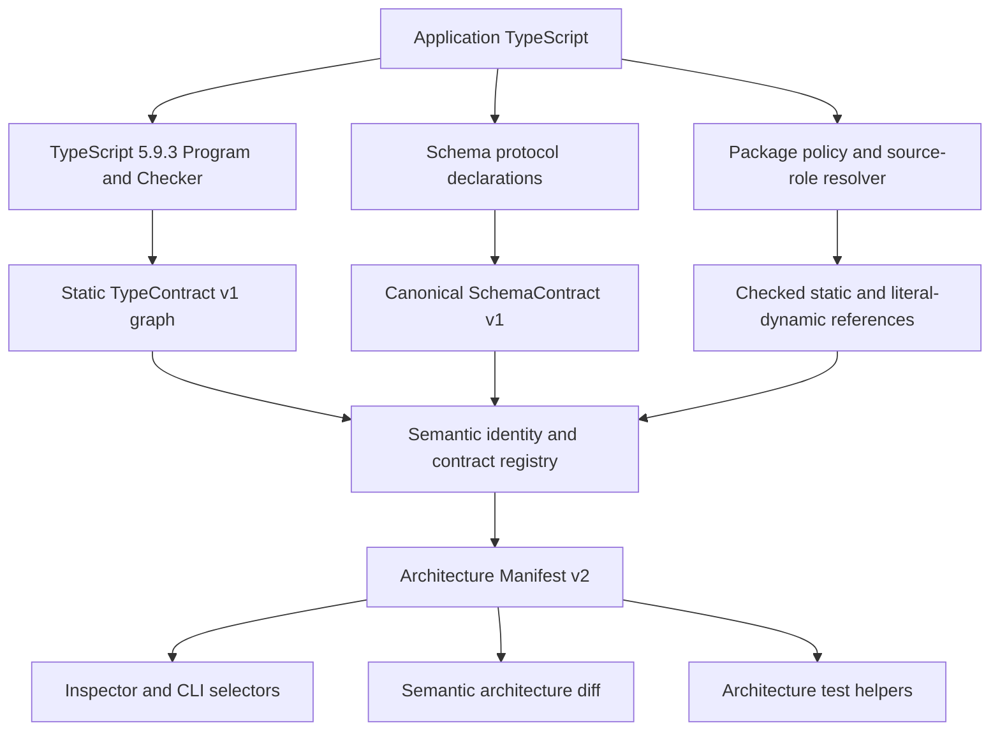
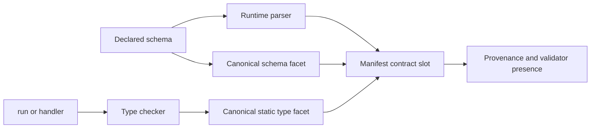
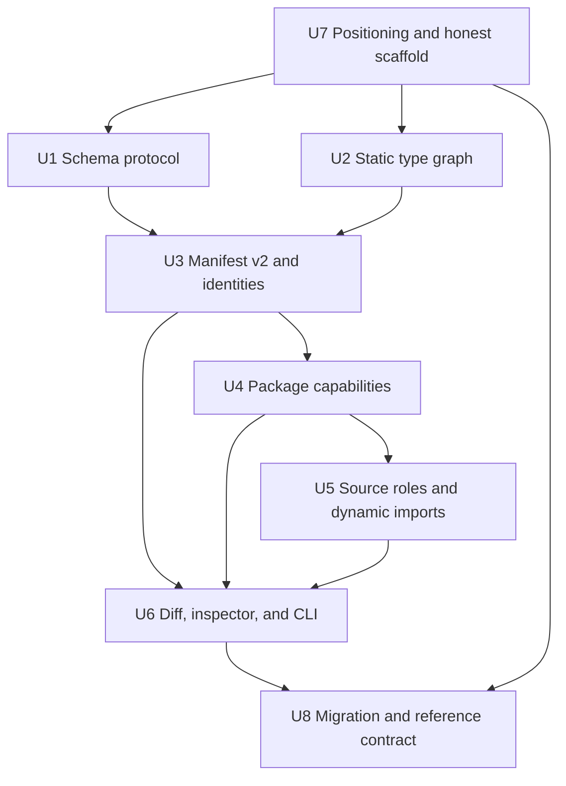

# Architecture Compiler Remediation - Plan

## Goal Capsule

- **Objective:** Make the shipped package an accurate, collision-safe, effect-aware TypeScript architecture kernel whose manifest distinguishes runtime validation from inferred static contracts.
- **Authority:** The confirmed compiler-focused scope and Product Contract govern behavior. Key Technical Decisions govern implementation. Implementation Units must not widen either contract.
- **Execution profile:** Cross-cutting public-contract refactor with compatibility notes, focused characterization tests, and one final repository-wide verification pass.
- **Stop conditions:** Stop and ask before adding a full-stack runtime, selecting a named validator package, weakening unsafe-typing rules, executing application source during analysis, or silently approximating an unsupported type or schema.
- **Tail ownership:** The implementing workflow owns code, tests, documentation, package checks, and local CI signoff. It does not own a release or deployment.

---

## Product Contract

### Summary

Remediate the architecture compiler before adding runtime integrations. The package will expose versioned semantic identities, explicit package capabilities, interoperable schema contracts, role-aware dynamic imports, and checker-inferred static contracts while describing its current scope accurately.

### Problem Frame

The published package currently presents itself as a framework for full-stack applications, but it ships an architecture analyzer, contract/runtime primitives, introspection, scaffolding, and a CLI rather than an HTTP server, rendered frontend, storage layer, or application bundler. The generated and reference applications also label no-emit TypeScript checks as builds.

The compiler has five structural limits. It classifies nearly every third-party runtime package as external I/O, owns a closed schema metadata algebra, applies the dynamic-import ban without source context, keys several semantic categories by unqualified names, and records declaration syntax instead of TypeScript types when output schemas are absent. These limits now affect public manifest types, architecture diffs, CLI output, generated projects, and agent understanding.

### Key Decisions

- **Compiler-focused remediation** (session-settled: user-directed — chosen over adding a minimal full-stack runtime slice: compiler correctness and truthful positioning are the current priority). Governs R1-R14.
- **Truthful current positioning** (session-settled: user-approved — chosen over describing the shipped package as a complete full-stack framework: the current package does not provide the runtime layers that claim implies). Governs R1-R2.

### Requirements

**Positioning and generated projects**

- R1. Package metadata, the README, the reference application, CLI help, and the architecture vision must call the shipped product an application architecture kernel, architecture framework, or architecture compiler with runtime contract primitives.
- R2. Current-scope documentation and generated scripts must state that HTTP serving, rendered UI, persistence, storage, and bundling are not provided; a no-emit TypeScript check must not be labeled as an application build.

**Effect-based package boundaries**

- R3. Every non-framework third-party runtime import or re-export must resolve to an explicit project-wide package capability instead of inheriting an external-I/O classification from package provenance.
- R4. Pure libraries, UI libraries, external-system clients, and host-I/O packages must have distinct policies; type-only references remain outside runtime capability checks, and unknown or conflicting runtime classifications fail with an actionable diagnostic.
- R5. Package policy must apply to static imports, side-effect imports, exports, scoped packages, subpaths, and allowed literal dynamic imports, and the effective package uses must appear in manifest v2.

**Schema interoperability**

- R6. Models, actions, queries, routes, events, and adapters must consume one validator-neutral schema protocol whose parser contract is synchronous and side-effect-free, whose canonical metadata is versioned, and whose adapted failures become sanitized path-aware `InvalidInput` issues.
- R7. The built-in schema DSL must retain its current validation and type-inference behavior, remain limited to its current transport/domain primitives, and support namespaced canonical extension nodes instead of growing a new general-purpose validation language.
- R8. An external schema can enter through one generic adapter only when it declares the synchronous parser contract and structurally complete canonical metadata. Detectable protocol or metadata defects fail at construction; a returned promise or thenable fails at the schema boundary before consumer code receives it. Parser-to-metadata fidelity remains an adapter-author attestation.

**Source-role TypeScript policy**

- R9. The analyzer must resolve infrastructure, UI/client, domain, and application roles consistently, report incompatible role signals, and keep `any`, unchecked assertions, non-null assertions, decorators, and `require()` restricted in every role.
- R10. A literal `import()` is permitted only in UI/client and infrastructure code, and it must pass through the same resolution, feature-boundary, runtime-boundary, package-capability, dependency, and cycle analysis as a static module reference; computed imports remain forbidden.

**Semantic identity and contracts**

- R11. Architecture manifest v2 must give every addressable semantic record a collision-safe category, owner, and local identity that does not depend on file paths, line numbers, declaration order, or implementation bodies.
- R12. Architecture diff, inspector, and CLI selectors must use semantic IDs, retain unqualified selectors only when unique, reject duplicate IDs, and report ambiguity instead of selecting the first match.
- R13. Operation and route contracts must contain a canonical static input/output type graph plus an independent runtime-schema facet; each facet records declared or inferred provenance and whether a runtime validator exists.
- R14. The analyzer must infer supported callback input and awaited return types through TypeScript 5.9.3, preserve domain labels as non-semantic provenance, and emit an unresolved contract plus an error for unsupported or unsound types rather than falling back to source text, `any`, or `unknown`.

### Success Criteria

- Two features can declare the same local operation, route, event, or adapter name without colliding in a manifest or diff.
- A pure date-style package can be approved without being described as external I/O, while an external-system client outside infrastructure still fails; existing projects receive one sorted unclassified-package inventory and a non-writing starter map for owner review.
- A schema supplied through the generic protocol behaves like a built-in schema across every runtime consumer, retains deterministic semantic metadata, and cannot expose raw input or vendor error details through public validation issues.
- A UI or infrastructure literal dynamic import contributes the same architecture evidence as a static import; a domain, application, or computed dynamic import fails.
- `approveInvoice` in the reference application exposes its inferred `InvoiceApproval` shape with no runtime output-validator claim, while `payInvoice` retains declared output validation.
- A newly generated application exposes architecture checking and type-checking without claiming to provide development or build pipelines.

### Acceptance Examples

- AE1. Given `date-fns` is classified as `pure`, when domain code imports it at runtime, then the package rule passes and the manifest records a pure package use.
- AE2. Given a Stripe-like SDK is classified as `external-system`, when feature code imports it outside infrastructure, then architecture checking fails with the package, capability, source role, and required boundary.
- AE3. Given unclassified runtime packages or two submitted policy keys that normalize to the same exact match with different capabilities, when the analyzer encounters them, then it emits package-capability errors rather than guessing effects and includes each unclassified package once in a sorted, non-writing starter map whose values still require owner choice.
- AE4. Given a generic adapted schema with canonical entity-ID and money metadata plus one namespaced extension, when models, operations, routes, events, and adapters consume it, then all consumers validate through the same normalized protocol and publish the same canonical metadata.
- AE5. Given literal dynamic imports in UI and infrastructure, when the analyzer resolves them, then public-feature boundaries, package policy, runtime boundaries, dependency edges, and cycles remain enforced; a computed specifier fails.
- AE6. Given `billing.list` and `reports.list`, when only `reports.list` changes output shape, then both IDs remain present and architecture diff reports one changed operation.
- AE7. Given an operation with no output schema and an awaited return type, when the analyzer emits manifest v2, then the static output is `inferred-typescript`, runtime-validator presence is `not-declared`, and no runtime-validation guarantee is implied.
- AE8. Given persisted manifest v1 JSON or a Git base before the v2 migration boundary, when a v2 consumer receives it, then it refuses comparison with a clear instruction to regenerate from source or choose the migration commit as the earliest supported architecture-diff base.
- AE9. Given a permission-protected operation or route with an adapted input parser, when the caller lacks that permission, then access fails before parser invocation; input-dependent `authorize` callbacks still receive parsed input and therefore require the parser's side-effect-free contract.
- AE10. Given an adapted parser failure containing raw input, vendor messages, stacks, or error objects, when the framework maps it to `InvalidInput`, then public issues retain only normalized paths, framework-owned safe codes/messages, expected types, and received types.

### Scope Boundaries

#### Included

- Runtime schema protocol and compatibility normalization.
- TypeScript analyzer, manifest, diagnostics, package policy, source roles, dependency collection, and contract extraction.
- Architecture diff, inspector, renderers, CLI behavior, Git snapshot comparison, generated applications, reference application, package metadata, and migration documentation.

#### Deferred to Follow-Up Work

- HTTP serving, React or other rendered UI integration, PostgreSQL or storage adapters, bundling, deployment, and a full-stack reference slice.
- First-party adapters for Standard Schema, JSON Schema, Zod, Valibot, ArkType, or any other named schema ecosystem. Live protocol research was unavailable, so this plan creates the neutral seam but does not select a dependency.
- Operation-level call graphs, reads, writes, emitted events, thrown-error inference, transitive effects, and claims such as “no external effects.” Manifest v2 provides identities and provenance that later analysis can build on.
- Asynchronous schema validation, coercion, transforms, refinements, defaults, forms, database schema generation, and recursive static type contracts.
- Rename aliases or explicit semantic-ID overrides. In this version, a declaration or owner rename is intentionally removal plus addition.

---

## Planning Contract

### Key Technical Decisions

- KTD1. **Manifest v2 is a breaking semantic boundary.** (session-settled: user-approved — chosen over silently changing manifest v1: identities, contracts, provenance, and package capabilities change the public meaning.) The analyzer emits v2 only. Persisted v1 data must be regenerated from source, and mixed-version diff or inspection fails clearly. Git architecture diff supports bases at or after the v2 migration commit, where both trees contain effective package policy; an earlier base fails with a migration-boundary message instead of producing a partial comparison. Covers R11-R14.
- KTD2. **Semantic IDs use one canonical grammar.** Serialized IDs follow the `sid1` grammar below. They derive from existing semantic names and add no declaration annotation. Operation kind and route method/path are mutable contract fields, not identity fields. Covers R11-R12.
- KTD3. **Static type and runtime schema are separate contract facets.** (session-settled: user-approved — chosen over requiring duplicate output schemas or treating TypeScript types as runtime validators: inference must report what code already proves without overstating runtime guarantees.) Structured facets replace opaque `contract` strings and carry provenance plus runtime-validator presence. Covers R13-R14.
- KTD4. **The schema boundary is validator-neutral, synchronous, and sanitizing.** (session-settled: user-approved — chosen over selecting a validator package now: ecosystem support could not be verified and the compiler must not depend on one validator.) A versioned string-marked protocol carries canonical metadata and a side-effect-free parser that returns a framework-owned success/failure result. Its public schema type retains literal metadata through a defaulted metadata type parameter. The generic adapter requires an explicit mapper from vendor failures to safe framework issues; raw throws become `Unexpected` with internal cause only. Normalization validates protocol shape without invoking parser code, and every parse boundary rejects a returned promise or thenable. Built-ins keep `.parse` and `.metadata` compatibility through one normalization path. Named adapters remain deferred. Covers R6-R8.
- KTD5. **Canonical schema metadata has a finite core and an extension node.** The core represents the current primitives and composition rules. A namespaced extension includes a version, a canonical JSON payload, and its underlying representation. The normalizer enforces structurally complete metadata and rejects unknown core nodes, invalid JSON values, cycles, and missing extension identity; behavioral fidelity is attested by the adapter author. Covers R7-R8.
- KTD6. **Package capabilities have one effective policy source per analysis.** (session-settled: user-approved — chosen over treating package origin as effect evidence: package effects require an explicit owner assertion.) When `AnalyzeApplicationOptions.packageCapabilities` is absent, analysis loads `typescriptOnRails.packageCapabilities` from the root `package.json`. This source-controlled map is available to the CLI and Git snapshots without executing application code. When the option is present, including an empty map, it replaces and ignores the package map. The CLI supplies no override. The framework package remains exempt, unknown runtime packages fail in every source role, and the removed `allowedExternalPackages` option receives breaking-migration guidance. Unknown-package diagnostics also expose one sorted inventory and a starter map without editing project files or choosing capabilities. Covers R3-R5.
- KTD7. **Only dynamic-import policy varies by source role.** (session-settled: user-approved — chosen over broadly relaxing infrastructure and UI TypeScript: unsafe typing remains costly at every seam.) UI/client and infrastructure may use string-literal or no-substitution-template `import()` calls. All other dynamic imports and every `require()` remain forbidden. Covers R9-R10.
- KTD8. **TypeScript contracts use a purpose-built acyclic graph IR.** TypeScript is pinned to 5.9.3 for analyzer determinism. The extractor uses checker signatures and awaited return semantics and emits a versioned graph for primitives, literals, arrays, tuples, objects, optional/readonly properties, unions, `Date`, explicit `unknown`, `undefined`/`void`, and shared references. Cycle detection rejects every recursive static type in version 1 with an unresolved facet and diagnostic. Unsupported nested types fail the whole facet. `typeToString` is diagnostic text only. Covers R13-R14.
- KTD9. **Consumers resolve IDs centrally.** Diff, inspector, and CLI share one resolver that accepts a semantic ID or a unique legacy name. Duplicate IDs invalidate diff inputs, ambiguous names return candidate IDs, and source movement remains non-semantic. Covers R11-R12.
- KTD10. **Generated projects advertise only working kernel commands.** A fresh scaffold generates architecture checking and type-checking scripts. It does not generate development, build, or test scripts without corresponding runtime or test artifacts. Existing `app dev`, `app build`, and `app test` commands remain explicit delegates to app-owned scripts and report a concise missing-script error. Covers R1-R2.
- KTD11. **Input-independent permission checks run before parsing.** Permission-based operations and routes reject missing permission before invoking an input parser. Public and permitted calls parse normally. Contextual `authorize` remains after parsing because it depends on typed input, so every built-in and adapted parser carries the side-effect-free contract from R6. Covers R6 and R8.

### High-Level Technical Design

### Semantic ID Grammar

Serialized IDs use `sid1/<category>/<owner-kind>/<owner-name>/<local-name>`.

| Component | Contract |
|---|---|
| `category` | One fixed token: `feature`, `public-export`, `model`, `operation`, `route`, `event`, `adapter-contract`, or `adapter-implementation` |
| `owner-kind` | `feature`, `infra`, or `app` |
| `owner-name` | The exact feature name for feature-owned records; `_` for `infra` and `app` |
| `local-name` | Feature name for feature records; exported name for public exports; declared name with the current variable fallback for models, events, and adapter contracts; variable binding for operations, routes, and adapter implementations |

Variable components must be nonempty. They encode UTF-8 bytes: RFC 3986 unreserved ASCII remains literal, while every other byte uses uppercase percent escapes. The encoder does not normalize Unicode. The decoder rejects empty components, malformed escapes, and noncanonical escapes. Blank declared model, event, or adapter names therefore produce an identity diagnostic. For example, text views may render `billing.approveInvoice`, while the serialized operation ID is `sid1/operation/feature/billing/approveInvoice`; an infrastructure adapter implementation uses `sid1/adapter-implementation/infra/_/payments`.

Dependencies, permissions, package uses, exceptions, and diagnostics remain evidence or projections rather than addressable declarations. Their diff keys use typed component tuples, not concatenated display strings.

### Schema Fidelity Boundary

- The normalizer can prove the protocol marker and version, parser callability, supported core-node shape, required extension identity and version, canonical JSON value constraints, cycle absence, and deterministic normalization.
- Runtime wrappers can prove that no returned thenable reaches consumer code. Adapted parsers return a framework-owned result; their error mapper may emit only normalized paths, framework-owned issue codes/messages, expected types, and received types. Raw input, vendor messages, stacks, and error objects never enter public issue details.
- Built-in schemas can claim parser/metadata fidelity because the framework owns their shared construction and tests.
- Adapted-schema metadata completeness, correspondence between parser behavior and metadata, extension meaning, declared output type, side-effect-free execution, and vendor-specific issue mapping are adapter-author attestations. Conformance tests prove only the adapter and fixtures they exercise.
- Runtime protocol acceptance does not imply static manifest extractability. The analyzer emits a canonical schema facet only when source-visible declarations, literal metadata types, or framework-owned built-ins let it reduce metadata without importing or executing modules. Opaque or widened runtime metadata leaves the declaration visible with an unresolved facet and an architecture error.

### Package Capability Model

| Capability | Meaning | Allowed source roles |
|---|---|---|
| `pure` | Owner-declared in-process utility with no external capability | Domain, application, UI/client, infrastructure, subject to runtime boundaries |
| `ui` | UI/client runtime library | UI/client only |
| `external-system` | Client for a service outside the application | Infrastructure only |
| `host-io` | Filesystem, process, network, VM, worker, or similar host access | Infrastructure only |

Node built-ins receive framework-owned classifications, with `node:` and bare forms normalized to one identity. Imports from `typescript-on-rails` remain framework-exempt. Type-only references do not require runtime classification. Runtime imports, exports, and side-effect imports do.

The effective map comes from exactly one source per KTD6 and is validated after source selection. An exact subpath entry may intentionally differ from its package-root entry and wins for that subpath. A contradiction exists only when two submitted keys normalize to the same exact match key with different capabilities.

### Source Role and Dynamic Import Matrix

| Effective role | Literal `import()` | Computed `import()` | `any`, assertions, non-null, decorators, `require()` |
|---|---|---|---|
| Infrastructure | Allowed and fully analyzed | Forbidden | Restricted |
| UI/client | Allowed and fully analyzed | Forbidden | Restricted |
| Domain | Forbidden | Forbidden | Restricted |
| Application | Forbidden | Forbidden | Restricted |

Role signals come from `src/infra`, feature UI paths, `.client` suffixes, `"use client"`, and existing domain file conventions. Incompatible signals emit a role-conflict diagnostic, and analysis applies the stricter union of applicable checks.

### Canonical Contract Rules

- Canonical structures use deterministic UTF-16 code-unit ordering, matching the repository's `compareText` convention, for object properties, named fields, definitions, and semantically unordered union members. Tuple order remains significant.
- Source paths, line numbers, compiler object IDs, traversal order, implementation bodies, and display aliases do not participate in contract equality.
- Declared `id` and `money` semantics come only from schema metadata. Static `string` or `number` inference never upgrades itself to those domain meanings.
- Alias names may appear as provenance or display labels but do not change structural equality. Shared acyclic definitions use canonical references. Any detected recursive type is unsupported in type-contract version 1.
- No arbitrary traversal-depth cap is introduced. Cycle detection and supported-kind checks bound traversal.
- Every recognized declaration remains visible. Failed extraction emits an unresolved facet and an architecture error instead of omitting the record.

### System-Wide Impact

- **Public API:** `ArchitectureManifest`, entity manifest types, semantic diff types, schema types, analyzer options, inspector selectors, and CLI JSON all change.
- **Runtime behavior:** Built-in validation, event delivery, and adapter validation remain unchanged. Permission checks that do not need input move before parsing; contextual authorization remains after parsing. Adapted error mapping adds sanitization without changing built-in validation messages.
- **Generated applications:** New scaffolds lose fake lifecycle scripts and gain explicit architecture/type checks. Existing applications receive migration instructions rather than silent rewrites.
- **Agent behavior:** IDs and provenance remove first-match ambiguity and distinguish static knowledge from runtime enforcement.
- **Security:** Analysis remains static. It must not import application modules, execute validator code, or trust package location as proof of purity.
- **Determinism:** TypeScript version pinning, shared canonical ordering, and source-independent IDs prevent machine- and checkout-specific contract drift.

### Risks and Mitigations

- **TypeScript compiler API drift:** Pin 5.9.3, isolate checker traversal in one module, record the compiler version in manifest v2, and require golden fixtures before a compiler upgrade.
- **Adapted schemas can violate their attestations:** Require structurally valid metadata, sanitized result mapping, side-effect-free parser documentation, and adapter conformance tests. Permission checks that do not need input run before adapted parsing; contextual authorization still relies on the attestation. Reject missing or malformed metadata without claiming generic behavioral proof.
- **Legacy structural schemas may be used outside this repository:** Accept the exact v1 `{ metadata, parse }` shape through the compatibility normalizer and mark it as legacy provenance. Any future removal needs a separate owner decision; this plan sets no release deadline.
- **Capability declarations can be wrong:** Make them explicit, searchable, diffable, and required. Keep local `architecture.allow` as the visible emergency escape hatch.
- **Role changes can produce false positives:** Characterize all current role signals before replacing `pathRole`, then test conflicting and installed-package cases.
- **Manifest v2 breaks persisted consumers:** Fail with a version-specific message and provide a source-regeneration migration path. Treat the migration commit as the earliest supported Git architecture-diff base; do not offer a lossy converter.
- **External schema protocol research was unavailable:** Keep named ecosystem support out of the implementation. Documentation may describe only the generic adapter contract as interoperable; it must not claim compatibility with a named ecosystem until a separately verified adapter spike proves it.

### Alternative Approaches Considered

- **Patch diff keys to `feature + name` while retaining manifest v1:** Rejected because package capabilities, structured contracts, and provenance also change manifest meaning.
- **Treat all unknown packages as pure or external I/O:** Rejected because either default silently weakens the boundary or preserves the current false classification.
- **Adopt a named validator or schema standard now:** Rejected because current support could not be verified and a vendor choice is not required to define the compiler seam.
- **Relax the whole TypeScript doctrine in UI and infrastructure:** Rejected because only literal dynamic loading has a demonstrated context-specific need.
- **Use `checker.typeToString` as the canonical contract:** Rejected because it is display text affected by context, aliases, formatting flags, and compiler releases.
- **Upgrade v1 manifests in memory:** Rejected because v1 omits inferred types, validation provenance, semantic IDs, and package capabilities.
- **Combine manifest production and final consumer behavior in one unit:** Rejected because changing the public manifest shape makes every current consumer fail to compile. U3 owns the mechanical v2 compile migration; U6 owns selector, ambiguity, and semantic-diff behavior after the producer contract is stable.

### Sources and Research

- `.docs/agent-native-typescript-framework-architecture.md` defines code-as-truth, real seams, boring TypeScript, deterministic inference, architecture compilation, and generated understanding.
- `src/infra/typescript/analyze.ts` is the convergence point for declaration extraction, imports, source roles, package checks, diagnostics, and manifest emission.
- `src/features/runtime/schema.ts` and `src/features/runtime/{model,executable,route,adapter,event}.ts` define the current schema contract and all runtime consumers.
- `src/features/architecture/manifest.ts` and `src/features/introspection/{diff,inspector,render}.ts` define the public semantic and agent-facing surfaces.
- `src/infra/project/scaffold.ts`, `src/features/tooling/cli.ts`, and `examples/reference-saas` define generated and reference behavior.
- `test/architecture.test.ts`, `test/introspection.test.ts`, `test/schema.test.ts`, `test/cli.test.ts`, and reference tests provide the current characterization patterns.
- `node_modules/typescript/lib/typescript.d.ts` confirms the 5.9.3 checker APIs for signatures, return types, awaited types, aliases, properties, and type traversal. Live external documentation and schema-protocol research were unavailable and are not load-bearing to this plan.

### Sequencing

### Shared-File Ownership

The plan uses one writer and serial unit boundaries. Repeated paths are intentional and each unit owns a different concern:

- `package.json`: U7 corrects positioning, U2 pins the analyzer compiler, U4 adds the repository capability policy, and U8 publishes the migration guide.
- `README.md`: U7 corrects current scope first; U8 adds final v2 examples and the migration link after the contract exists.
- `src/infra/typescript/analyze.ts`: U2 adds isolated type extraction, U3 integrates manifest v2, U4 replaces package classification, and U5 adds role-aware dynamic references.
- Introspection, CLI, testing, and Git snapshot consumers: U3 performs the mechanical compile migration required by the new manifest shape; U6 applies final ID resolution, ambiguity, version-boundary, and diff semantics.
- Shared tests reappear only when the owning behavior changes. Each unit must leave its focused test set and static types green before the next owner edits the same file.

---

## Implementation Units

### U7. Correct current positioning and scaffold commands

- **Goal:** Remove unsupported full-stack and lifecycle claims before the larger compiler migration begins.
- **Requirements:** R1-R2.
- **Dependencies:** None.
- **Files:**
  - Modify `README.md`.
  - Modify `package.json`.
  - Modify `.docs/agent-native-typescript-framework-architecture.md`.
  - Modify `src/infra/project/scaffold.ts`.
  - Modify lifecycle messaging in `src/features/tooling/cli.ts`.
  - Modify `test/cli.test.ts`.
- **Approach:**
  1. Describe the shipped package as an agent-native TypeScript architecture kernel/compiler with executable contract primitives and name its missing runtime layers plainly.
  2. Mark the long architecture document as product vision and distinguish its future full-stack target from current package behavior.
  3. Generate only working `check` and `typecheck` scripts for an empty application, pin its TypeScript tool to 5.9.3, and remove the unused generated `tsx` dependency. Do not generate `dev`, `build`, or `test` scripts without matching runtime or test artifacts.
  4. Keep `app dev`, `app build`, and `app test` as app-owned delegates. Detect missing package scripts before process launch and return a concise message that the kernel does not supply that lifecycle.
- **Execution note:** Land this unit first so package users receive truthful positioning even if later compiler work pauses.
- **Patterns to follow:** The README leads with a small working example; the vision document remains aspirational; scaffold writes remain atomic, rollback-safe, idempotent, and collision-safe.
- **Test scenarios:**
  1. Package metadata and README contain no claim that the shipped implementation supplies a full-stack runtime.
  2. A generated package contains architecture and type-check scripts, TypeScript 5.9.3, no fake dev/build/test script, no unused `tsx` dependency, and still type-checks.
  3. `app dev`, `app build`, or `app test` delegates when the app owns the script and returns a concise missing-script error when it does not.
  4. Scaffold rollback, retry, nonempty-target, unsafe-name, collision, and public-export tests remain unchanged.
- **Verification:** A new user can tell what the package does, what it does not do, and which generated commands are real without reading source code.

### U1. Introduce the validator-neutral schema protocol

- **Goal:** Decouple every runtime schema consumer from the closed metadata union while preserving current built-in behavior.
- **Requirements:** R6-R8, R13.
- **Dependencies:** U7.
- **Files:**
  - Create `src/features/runtime/schema-protocol.ts`.
  - Modify `src/features/runtime/schema.ts`.
  - Modify `src/features/runtime/model.ts`.
  - Modify `src/features/runtime/executable.ts`.
  - Modify `src/features/runtime/route.ts`.
  - Modify `src/features/runtime/adapter.ts`.
  - Modify `src/features/runtime/event.ts` and `src/features/runtime/errors.ts`.
  - Modify `src/features/runtime/index.ts` and `src/index.ts`.
  - Modify `test/schema.test.ts`, `test/model.test.ts`, `test/executables.test.ts`, `test/adapters.test.ts`, and `test/events.test.ts`.
- **Approach:**
  1. Define independent protocol and canonical-schema versions, a stable string marker, the finite core node set, and one namespaced extension node per KTD4-KTD5.
  2. Add one schema normalizer that validates protocol shape and canonical metadata before any model, operation, route, event, or adapter stores it; do not invoke parser code during normalization.
  3. Make the schema type's metadata parameter default for source compatibility, preserve literal metadata for static extraction, and make built-ins retain existing `.parse`, `.metadata`, `Infer`, `SchemaFields`, and `ObjectOutput` behavior.
  4. Add one generic adapter constructor that requires structurally complete canonical metadata, a side-effect-free synchronous parser returning the framework result type, and an explicit vendor-error mapper. Preserve only normalized paths, framework-owned safe issue codes/messages, expected types, and received types; raw input and vendor error details remain internal.
  5. Reject a returned thenable at each parse boundary and normalize unexpected parser throws to `Unexpected` with cause but no public vendor details.
  6. Accept the exact legacy structural schema shape through the same normalizer with legacy provenance; do not preserve loose `"parse" in value` detection.
  7. Move input-independent permission rejection before parsing in operations and routes. Keep public parsing and input-dependent contextual authorization in their current typed order.
- **Patterns to follow:** `schema()` centralizes parser construction; `InvalidInput` aggregates path-aware issues; current runtime consumers normalize before execution and keep vendor values out of public contracts.
- **Test scenarios:**
  1. Every existing primitive, nested object, optional field, issue path, unknown-key omission, and metadata-serialization test remains unchanged in behavior.
  2. Covers AE4. One generic adapted schema validates valid and invalid values through models, actions, queries, routes, events, and adapter operations.
  3. A canonical extension retains namespace, version, underlying representation, and canonical JSON payload through nested objects and normalized metadata.
  4. Missing markers, unsupported protocol versions, non-callable parsers, cyclic/non-JSON metadata, unknown core kinds, and incomplete extensions fail at declaration construction with a metadata path.
  5. An untyped adapter parser that returns a promise or thenable fails at the schema boundary before a model, handler, subscriber, or adapter operation receives it.
  6. The legacy `{ metadata, parse }` shape normalizes to the same core metadata and carries legacy provenance.
  7. Adapted nested metadata round-trips exactly after canonical ordering; tests make no generic claim that arbitrary parser behavior matches supplied metadata.
  8. Covers AE9. A missing permission rejects before an adapted parser runs; a contextual `authorize` callback parses once before its input-dependent decision.
  9. Covers AE10. Secret-bearing vendor messages, raw values, stacks, and error objects do not enter public `InvalidInput` messages or details; mapped safe paths, codes, expected types, and received types remain.
- **Verification:** Runtime consumers share one normalized schema path, permission and contextual authorization follow KTD11, adapted errors obey the public sanitization contract, existing built-in validation semantics remain stable, and no named validator dependency enters `package.json`.

### U2. Add canonical TypeScript contract extraction

- **Goal:** Infer supported static input and awaited output contracts without executing application code or persisting checker display text.
- **Requirements:** R13-R14.
- **Dependencies:** U7.
- **Files:**
  - Create `src/infra/typescript/type-contract.ts`.
  - Modify `src/infra/typescript/analyze.ts` and `src/infra/typescript/index.ts`.
  - Modify `package.json` and `package-lock.json` to pin TypeScript 5.9.3.
  - Create `test/type-contract.test.ts`.
  - Modify `test/architecture.test.ts` and `test/helpers/app-fixture.ts`.
- **Approach:**
  1. Define `TypeContract` graph version 1 and one canonical serializer using the rules in KTD8.
  2. Resolve `run` and `handler` signatures through the checker, extract callback input, and apply awaited-type semantics to return values.
  3. Support the explicit acyclic type boundary in KTD8, including shared references and explicit `unknown`; detect any recursive type and reject the whole facet in version 1.
  4. Preserve application alias and interface labels as provenance only, and isolate all TypeScript-version-sensitive traversal in this module.
  5. Emit stable contract diagnostics and unresolved facets for `any`, recursion, unresolved generics, callable/construct signatures, unsupported classes or index signatures, and invalid awaitables.
- **Execution note:** Add characterization fixtures for current generated and reference callback shapes before replacing syntax-only expectations.
- **Patterns to follow:** Existing `typeHasAny` and `typeHasVendorOrigin` use cycle-aware checker traversal without arbitrary depth limits; `compareText` provides locale-independent ordering.
- **Test scenarios:**
  1. `InvoiceApproval` becomes a canonical object with `invoiceId` and `approvedBy`; alias display changes do not change structural equality.
  2. Sync, async, nested promise-like, delegated route, `undefined`/`void`, nullable, array, tuple, optional/readonly object, union, and `Date` outputs lower to stable graph nodes.
  3. Reordered source declarations, imported aliases, and equivalent inline versus named handlers produce byte-equivalent canonical type graphs.
  4. `any`, named or anonymous recursion, unsupported callables/classes/index signatures, and unresolved conditionals/generics emit deterministic diagnostics and unresolved facets without partial widening.
  5. The same fixture analyzed in two checkout roots produces identical type-contract data.
  6. Extractor fixtures run under exactly TypeScript 5.9.3; changing the compiler version forces explicit golden-output and supported-kind review.
- **Verification:** Static contracts use checker semantics and the purpose-built graph only; `typeToString` appears only in diagnostic detail.

### U3. Emit manifest v2 with semantic identities and contract facets

- **Goal:** Replace name-only and syntax-string architecture records with versioned semantic entities.
- **Requirements:** R11-R14.
- **Dependencies:** U1, U2.
- **Files:**
  - Modify `src/features/architecture/manifest.ts`.
  - Modify `src/features/architecture/index.ts` and `src/index.ts`.
  - Modify `src/infra/typescript/analyze.ts`.
  - Modify `src/features/runtime/adapter.ts` and `src/features/runtime/app.ts` where adapter contract linkage is exposed.
  - Mechanically adapt `src/features/introspection/diff.ts`, `src/features/introspection/inspector.ts`, `src/features/introspection/render.ts`, `src/features/introspection/index.ts`, `src/features/tooling/cli.ts`, `src/features/testing/index.ts`, and `src/infra/project/git-snapshot.ts` to the v2 shape.
  - Modify `test/architecture.test.ts`, `test/adapters.test.ts`, `test/dogfooding.test.ts`, `test/introspection.test.ts`, `test/cli.test.ts`, and `test/testing.test.ts`.
- **Approach:**
  1. Define manifest v2 records for semantic IDs, schema/type contract facets, provenance, validator presence, package uses, and compiler/protocol versions.
  2. Derive IDs with the canonical `sid1` grammar without asking developers for duplicate annotations.
  3. Replace `contract: string` with structured fields for model fields, operation/route input and output, event payload, and adapter operations.
  4. Resolve schema constants and imported schema aliases through protocol metadata types; do not evaluate source modules. Runtime-only or widened metadata produces an unresolved facet per the Schema Fidelity Boundary.
  5. Link adapter implementations to their resolved contract IDs when the checker can prove the target.
  6. Register every ID before final sorting, retain conflicting records for evidence, and emit a duplicate-ID diagnostic with related locations.
  7. Emit unresolved records for recognized declarations whose names, contracts, or links cannot be established.
  8. Migrate every manifest consumer and its existing tests mechanically in this unit so the repository keeps compiling. Preserve the current command surface and source-noise behavior; U6 owns ambiguity resolution and final semantic comparison behavior.
- **Patterns to follow:** Framework import alias/namespace recognition, deterministic sorting, installed-package type handling, file-local allowances, and duplicate model-owner diagnostics in `src/infra/typescript/analyze.ts`.
- **Test scenarios:**
  1. Same-named operations, routes, events, and adapter contracts in different features receive distinct IDs.
  2. Duplicate IDs inside one owner retain both records and fail architecture checking with both locations.
  3. Reserved characters, percent signs, slashes, Unicode names, and the `_` owner sentinel encode and decode canonically; blank names and malformed or noncanonical IDs fail.
  4. File moves, line changes, object-key order, and implementation-body edits do not change IDs or canonical contracts.
  5. Owner or declaration renames produce removal/addition identity semantics; action-to-query and route method/path changes retain the ID and change contract fields.
  6. Covers AE7. `approveInvoice` has inferred static output and no declared runtime output validator; `payInvoice` has both a static output and declared schema validation.
  7. Model ownership remains globally checked even though model records receive owner-qualified IDs.
  8. Adapter implementations identify their contract when resolvable and emit an unresolved link diagnostic otherwise.
  9. Manifest compiler metadata records exactly TypeScript 5.9.3 plus the schema/type protocol versions, and a future version change fails compatibility fixtures instead of silently changing snapshots.
- **Verification:** The analyzer emits only manifest version 2, no opaque contract string remains, every addressable record has one deterministic semantic ID, and all mechanically migrated consumers compile and pass their existing behavior checks at this unit boundary.

### U4. Replace external-package provenance with package capabilities

- **Goal:** Make package boundaries express effects and runtime purpose instead of treating all third-party code as I/O.
- **Requirements:** R3-R5.
- **Dependencies:** U3.
- **Files:**
  - Create `src/infra/project/package-policy.ts`.
  - Modify `src/infra/project/index.ts`.
  - Modify `src/features/architecture/manifest.ts`.
  - Modify `src/features/runtime/architecture.ts` and `src/features/runtime/index.ts` only where capability types are public.
  - Modify `src/infra/typescript/analyze.ts` and `src/features/tooling/cli.ts`.
  - Modify `package.json` to declare the repository's own runtime `typescript` capability.
  - Modify `test/helpers/app-fixture.ts`, `test/architecture.test.ts`, `test/cli.test.ts`, `test/testing.test.ts`, and `test/dogfooding.test.ts`.
- **Approach:**
  1. Select exactly one effective policy source per KTD6: load `typescriptOnRails.packageCapabilities` only when the options property is absent; otherwise use the supplied map as a complete replacement, including an empty map.
  2. Normalize scoped roots, subpaths, and `node:` aliases. Let exact subpaths override package roots and reject only entries that normalize to the same exact key with different capabilities.
  3. Require classification for every non-framework third-party value import, export, side-effect import, and allowed dynamic import, including imports from infrastructure.
  4. Apply the role matrix in the Package Capability Model and keep type-only imports outside runtime checks.
  5. Replace the old all-packages `external-io` branch and remove `allowedExternalPackages`; retain the framework-package exemption and privileged Node behavior through framework-owned classifications.
  6. Emit effective package policy and package-use records in manifest v2 so policy or usage changes are diffable.
  7. Aggregate unknown uses by normalized package and add one sorted inventory plus a non-writing `packageCapabilities` starter map to text and JSON diagnostics. Placeholder values must remain invalid until an owner selects a capability.
  8. Update shared fixtures to provide a minimal project policy or an explicit complete options replacement rather than hiding missing configuration.
- **Patterns to follow:** Existing module reference collection, scoped `packageName`, Node built-in normalization, target-specific allowances, and concise architecture diagnostics.
- **Test scenarios:**
  1. Covers AE1 and AE2. `pure`, `ui`, `external-system`, and `host-io` packages pass only in allowed roles.
  2. Covers AE3. Unknown packages, invalid capabilities, and duplicate exact keys produced by normalization fail clearly; repeated imports produce one sorted inventory entry with all source evidence and one unclassified starter-map value.
  3. An absent options property loads package policy; a supplied nonempty or empty map replaces it wholesale; a file-only entry becomes unknown under replacement.
  4. Scoped package roots and intentionally different exact subpaths choose the most specific policy.
  5. Named, default, namespace, star, side-effect, and mixed type/value imports and re-exports retain package evidence; type-only forms do not.
  6. Bare and `node:` privileged built-ins resolve to one framework-owned identity, pure built-ins such as path retain their current allowance, and `typescript-on-rails` remains exempt.
  7. A local barrel cannot hide the originating external package use from manifest output.
  8. Missing `package.json`, missing policy, malformed policy, and use of removed `allowedExternalPackages` produce distinct migration or configuration diagnostics.
  9. A freshly generated application remains architecture-clean because its framework import is exempt; the repository and reference application declare every other runtime package they use.
- **Verification:** `ARCH007` no longer labels every external package as I/O, unknown packages never receive an implicit effect, project and options policy never merge, and repository/reference/scaffold dogfooding remains clean.

### U5. Make TypeScript rules role-aware and analyze literal dynamic imports

- **Goal:** Permit legitimate lazy loading at UI and infrastructure seams without creating architecture blind spots.
- **Requirements:** R9-R10.
- **Dependencies:** U3, U4.
- **Files:**
  - Create `src/infra/typescript/source-role.ts`.
  - Modify `src/infra/typescript/analyze.ts`.
  - Modify `test/architecture.test.ts` and `test/dogfooding.test.ts`.
- **Approach:**
  1. Replace independent role booleans with one role resolver that retains all signals, reports incompatible combinations, and applies the strict union on conflict.
  2. Keep existing unsafe-type, decorator, non-null, assertion, and `require()` checks global.
  3. Collect literal dynamic imports as module references with source locations and namespace-wide symbol use.
  4. Resolve them with the active TypeScript compiler options and feed them through existing feature, runtime, domain/UI, package, dependency, and cycle checks.
  5. Reject interpolation, concatenation, variables, and other computed specifiers in every role.
- **Patterns to follow:** `hasUseClient`, `referencedValueDeclarationFiles`, static module resolution, feature dependency aggregation, and cycle diagnostics.
- **Test scenarios:**
  1. Covers AE5. String-literal and no-substitution-template imports pass in UI/client and infrastructure, create deterministic `*` dependency edges, and participate in cycle detection.
  2. Covers AE5. The same literal import fails in domain and application code.
  3. Computed, concatenated, interpolated, and variable specifiers fail in every role.
  4. Dynamic imports of private cross-feature files, server/infra targets from UI, and packages with disallowed or missing capabilities fail through the normal diagnostics.
  5. Path aliases and external packages resolve consistently with static imports.
  6. A client-marked domain file or UI-path domain module reports a role conflict and does not gain the more permissive rule.
  7. Existing `any`, assertion, non-null, decorator, and `require()` fixtures continue to fail in every role.
- **Verification:** Allowed dynamic imports appear in dependency and package projections, and no role exemption weakens the existing typing doctrine.

### U6. Migrate diff, inspection, CLI, and Git snapshot consumers

- **Goal:** Make every agent-facing architecture view consume manifest v2 identities and structured contracts safely.
- **Requirements:** R5, R11-R14.
- **Dependencies:** U3, U4, U5.
- **Files:**
  - Modify `src/features/introspection/diff.ts`.
  - Modify `src/features/introspection/inspector.ts`.
  - Modify `src/features/introspection/render.ts` and `src/features/introspection/index.ts`.
  - Modify `src/features/tooling/cli.ts`.
  - Modify `src/features/testing/index.ts`.
  - Modify `src/infra/project/git-snapshot.ts` only where version contracts require it.
  - Modify `test/introspection.test.ts`, `test/cli.test.ts`, and `test/testing.test.ts`.
- **Approach:**
  1. Build on U3's mechanical consumer migration and introduce one semantic selector resolver for exact IDs and unique unqualified names; expose typed not-found and ambiguity outcomes with candidate IDs.
  2. Key every semantic category by ID and compare canonical contract facets, provenance, validator presence, access, adapter linkage, package policy, and package uses.
  3. Reject duplicate-ID or non-v2 diff inputs before map construction; do not add order-based suffixes or infer renames.
  4. Keep root paths, source locations, line movement, and implementation-body changes outside semantic equality.
  5. Update text output to lead with qualified display names and update JSON contracts as one deliberate v2 migration.
  6. Preserve Git architecture diff for v2-ready trees by analyzing both with the current analyzer. If the base predates the migration policy or either analysis is not v2-clean, fail with the earliest-supported-base guidance from KTD1.
- **Patterns to follow:** Current semantic projections deliberately omit source noise; CLI dependency injection supports focused tests; Git snapshot code remains read-only and uses one object reader.
- **Test scenarios:**
  1. Covers AE6. Editing one of two same-local-name operations changes only its semantic ID entry.
  2. Duplicate IDs cause a typed diff failure rather than a `Map` overwrite.
  3. Unique legacy names continue to resolve; ambiguous operation, model, public export, event, adapter, and route selectors fail with sorted candidate IDs.
  4. Exact semantic IDs return only the selected owner, callers, route, or impact result.
  5. Covers AE7. Runtime-schema removal with unchanged static shape reports a provenance/validator change.
  6. Package capability and use changes appear in semantic diff without source-location noise.
  7. Covers AE8. v1, mixed-version, malformed manifest inputs, and pre-migration Git bases return regeneration or earliest-supported-base guidance; v2-to-v2 Git snapshot diff remains deterministic.
  8. Existing binary snapshot, object-reader cleanup, ref validation, and no-source-mutation tests remain intact.
- **Verification:** No consumer uses first-match name selection or opaque contract strings, and all JSON/text views agree on semantic IDs.

### U8. Publish the v2 migration and reference contract

- **Goal:** Give existing consumers a complete v2 migration path and make the reference application prove the final semantic distinctions.
- **Requirements:** Migration and reference proof for R3-R14.
- **Dependencies:** U6, U7.
- **Files:**
  - Create `MIGRATION.md` and include it in the published package files through `package.json`.
  - Update `README.md` with final v2 contract examples and the migration link.
  - Create `examples/reference-saas/README.md`.
  - Modify `examples/reference-saas/package.json` and `examples/reference-saas/tsconfig.json` only as needed for honest check naming and the supported TypeScript version.
  - Modify `test/dogfooding.test.ts`, `examples/reference-saas/test/billing.test.ts`, and `examples/reference-saas/test/identity.test.ts`.
- **Approach:**
  1. Write the v1-to-v2 migration guide: regenerate persisted manifests, use the migration commit as the earliest Git architecture-diff base, adopt the `sid1` grammar and structured facets, declare package capabilities, migrate schema adapters, update selectors and JSON consumers, remove `allowedExternalPackages`, and rename app scripts.
  2. Explain the unclassified-package inventory and starter map without implying that the compiler chooses capabilities.
  3. Rename reference no-emit build/development scripts as checks, retain its real test script, and document that its UI module is a view model rather than rendered frontend.
  4. Extend reference assertions so `approveInvoice`, `payInvoice`, routes, events, adapters, and package policy demonstrate inferred versus declared contracts and stable identities.
  5. Include `MIGRATION.md` in the package and inspect the package dry run for only intended public artifacts.
- **Patterns to follow:** The reference tests describe domain promises; package publishing includes only `dist`, public documentation, and license material.
- **Test scenarios:**
  1. Covers AE8. Migration guidance rejects lossless v1 conversion and identifies the migration commit as the earliest supported architecture-diff base.
  2. The reference package uses honest check/test names and the exact TypeScript version supported by the analyzer.
  3. Reference architecture output proves inferred versus declared outputs, stable IDs, package policy, and zero architecture errors while all domain tests still pass.
  4. The package dry run includes `README.md`, `MIGRATION.md`, declarations, runtime output, and the CLI entry without secret or workspace files.
- **Verification:** Existing users can identify every breaking v2 change, regenerate from source, classify packages without an automatic guess, and verify the reference behavior.

---

## Verification Contract

| Gate | Command | Proves |
|---|---|---|
| Static types | `npm run typecheck` | Public API, protocol generics, fixtures, generated/reference code, and exact TypeScript compatibility compile |
| Runtime schema focus | `node --import tsx --test test/schema.test.ts test/model.test.ts test/executables.test.ts test/adapters.test.ts test/events.test.ts` | Protocol normalization preserves all runtime validation paths |
| Compiler focus | `node --import tsx --test test/type-contract.test.ts test/architecture.test.ts test/introspection.test.ts` | Canonical inference, IDs, package capabilities, roles, dynamic imports, and semantic diff behavior |
| Tooling focus | `node --import tsx --test test/cli.test.ts test/testing.test.ts test/dogfooding.test.ts` | CLI, Git diff, helpers, both dogfood applications, and a fresh generated application consume v2 and the package policy |
| Full behavior | `npm test` | Framework and reference domain promises pass together |
| Distribution emit | `npm run emit` | Compiled JavaScript/declarations are current before architecture checks |
| Self architecture | `npm run architecture:check` | The framework obeys its own package, role, and boundary rules |
| Reference architecture | `npm run reference:check` | The reference application remains architecture-clean under v2 |
| Full local CI | `npm run check` | Repository-defined type, test, emit, architecture, and reference gates pass in the required order |
| Package contents | `npm pack --dry-run` | Published files, entry points, migration guide, and package metadata are coherent |
| Diff hygiene | `git diff --check` | No whitespace errors or malformed patch content remain |
| CI/CD signoff | `gh signoff` | Repository CI/CD policy records the locally passing checks |

The implementation must also inspect the final `app check --json` payload, one ambiguous selector error with candidate `sid1` IDs, and one text `app diff --architecture` result directly. Exit codes alone do not prove that identities, provenance, ambiguity errors, or positioning read correctly.

---

## Definition of Done

- R1-R14 and AE1-AE10 are satisfied by direct tests or artifact inspection.
- U1-U8 meet their verification outcomes and every feature-bearing unit includes its focused tests.
- Manifest v2 contains collision-safe IDs, structured schema/static facets, provenance, validator presence, package capabilities, and deterministic compiler/protocol versions.
- No v2 analyzer or consumer relies on unqualified-name map keys, source-text contract strings, checker display text, absolute checkout paths, or source execution for semantic truth.
- Built-in schema parsing, adapter validation, event behavior, and reference domain promises remain unchanged; permission checks and adapted error mapping follow KTD4 and KTD11.
- Allowed literal dynamic imports enter the full architecture pipeline; all computed imports and global unsafe-TypeScript constructs remain rejected.
- Generated projects and public docs make no unsupported full-stack, development-server, rendered-UI, database, or build-pipeline claim.
- `MIGRATION.md` gives a complete source-regeneration path for manifest v1 and explicit migrations for package policy, schema adapters, selectors, JSON output, and scripts.
- All Verification Contract gates pass, `gh signoff` succeeds, and final inspection finds no secrets, debug output, accidental files, stale generated output, or unrelated scope growth.
- Code from abandoned or superseded implementation attempts is removed before completion.
