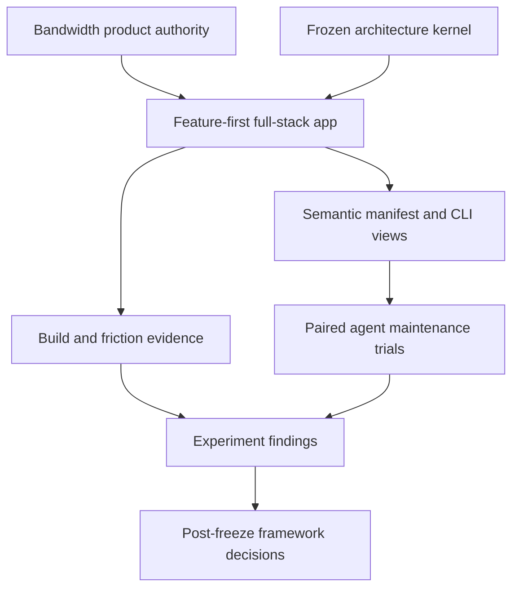
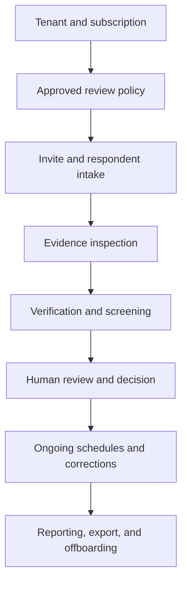
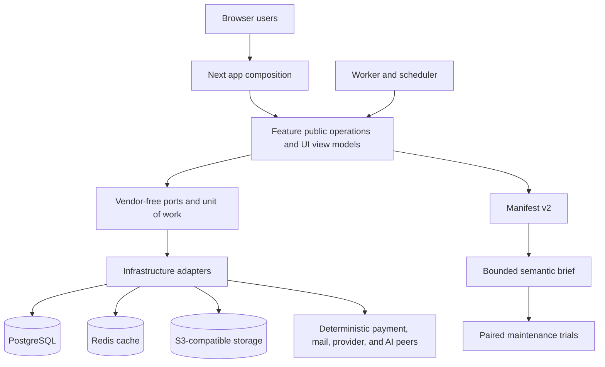
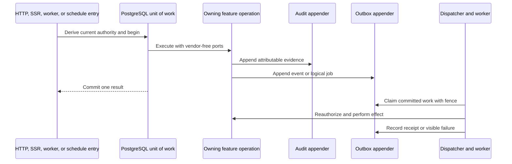
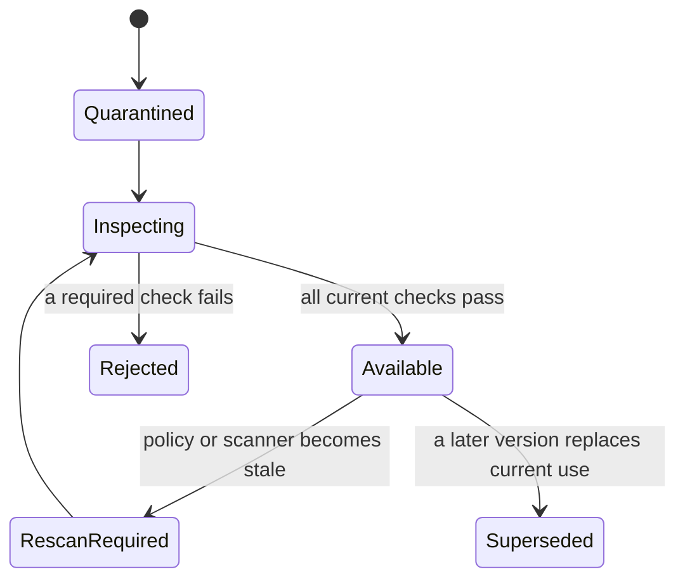
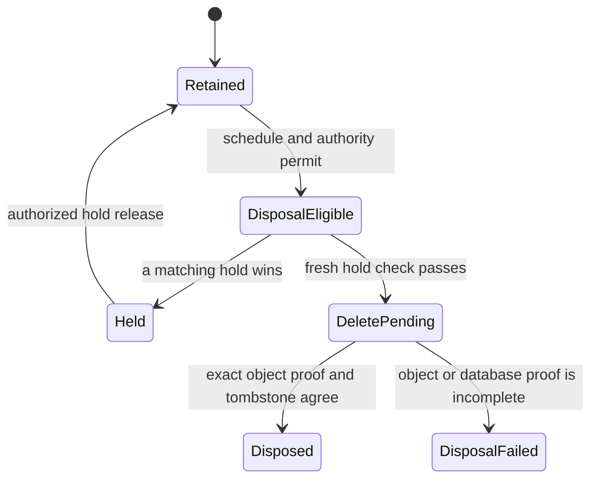
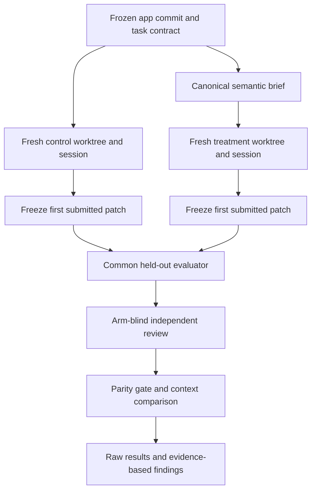
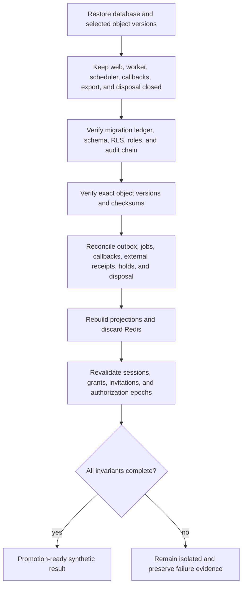
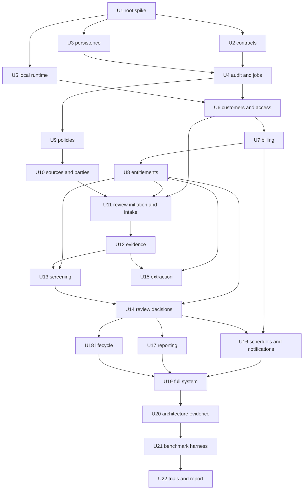

# Bandwidth Full-Stack Framework Experiment - Plan

## Goal Capsule

| Field | Value |
|---|---|
| Objective | Rebuild Bandwidth's AML demo as one serious full-stack TypeScript on Rails application, then use it to test feature boundaries, package capability classification, and agent context radius. |
| Target repository | `smillunchick/bandwidth-platform`; every implementation path in this plan is relative to that repository. |
| Product authority | The confirmed Product Contract, Bandwidth's AML product sources and safety rules, and the current public TypeScript on Rails contracts. Bandwidth's former product package layout and TypeScript 6 baseline are not binding. |
| Stop conditions | Stop the affected slice before changing the frozen compiler, weakening a Product Contract rule, using real data or credentials, activating a live external account, or touching unrelated local work. |
| Execution profile | Deep, trust-boundary-first work with synthetic data, deterministic external substitutes, vertical feature slices, and independent review before benchmark evidence counts. |
| Tail ownership | Application work closes only after the full local product passes its gates and the paired trials produce a reproducible findings report. |
| Open blockers | The framework source-identity condition closes only when the corrected baseline receipt binds a committed framework candidate. The frozen Bandwidth app also fails the complete Manifest v3 gate; closing that blocker requires a separately approved, committed executable-graph migration and a new U19 freeze. No new measured pair may run until both conditions close. Live-service smoke tests and production deployment remain deferred. |

---

## Corrected Framework Baseline Amendment (2026-09-02)

This amendment changes only the framework baseline, Manifest v3 admission gate, canonical brief source, artifact identity, and complete-versus-inconclusive rule for any confirmatory execution. For confirmatory work, its public `app brief` rule supersedes the private Manifest v2 projection in KTD16 and the matching brief-construction steps and tests in U21. Those older sections remain historical descriptions of U20-U22; their receipts and results do not change. The amendment does not change the Product Contract, feature ownership, product behavior, seven stress classes, task prompts, held-out checks, or prior U20-U22 evidence.

### Frozen local package set

The Bandwidth handoff receipt is `experiments/framework-baseline/baseline.json` in the target repository. It identifies a local TypeScript on Rails candidate by:

- base commit `1ae8f612365c729b0e60687b7160309b07fa0ab3`;
- source-subset SHA-256 `bcd53da727cecaa32c0c202b9f28d6ac08b61323940fd6b8344fe7aa3e15d7fa` over 280 non-ignored source entries, excluding `.pi/`, Git-ignored files, and this self-referential handoff plan;
- source lock SHA-256 `cd1b789059e236fe5f6ca55ce42f9126c8f01845120322dec7de2b59d03c5ee0`;
- Node 22.23.2, npm 10.9.8, and TypeScript 5.9.3; and
- six version-0.1.0 package archives under `experiments/framework-baseline/packages/`, each bound by the receipt's byte count, SHA-256, and SHA-512 integrity.

A second pack on the same host, from the same build and toolchain, was byte-identical; this is same-environment determinism, not cross-platform reproducibility. The first local receipt captured an uncommitted tree. The delivery flow must bind the resulting framework commit before the Bandwidth evidence change merges. The receipt identifies a pre-stable candidate, not a release or published framework version. `sourceLock` identifies the framework producer's npm `package-lock.json`; `compatibility.json` separately binds the frozen Bandwidth consumer's pnpm lock. A measured pair still requires one committed framework source and one committed Bandwidth base.

### Admission and treatment context

Before any confirmatory pair:

1. Both arms must install the same receipt and package archive hashes and produce the same lockfile hash. A package, archive, lock, source, prompt, tool, service, model, evaluator, or environment mismatch taints the full pair.
2. `app check --json` must pass. Separately, `app manifest --v3 --json` must report Manifest v3 composition protocol 4, linkage protocol 4, `completeness.complete: true`, and `completeness.counts.declared > 0`. A passing legacy check or Manifest v2 remains compatibility evidence and cannot replace the Manifest v3 gate.
3. Treatment context must come only from the public `app brief <feature> --json` command. For a task with several implementation-blind feature selectors, the harness must call the command once per selector in ordinal order and bind the exact outputs and their canonical envelope hash. It must not reconstruct a private brief from Manifest v2. Control receives no initial brief.
4. A missing, empty, incomplete, path-dependent, or non-reproducible public brief blocks the pair. It must not be replaced with source bodies, a hand-curated registry, or inferred runtime behavior.

### Current result and exit rule

`experiments/framework-baseline/compatibility.json` records the first corrected-baseline probe against Bandwidth's frozen application commit `184657d58a9aecff3b030a8da3f66432a3f35ca5` and tree `d12d8c95e1f8c2d018f5ed93e679e3fdeebb5d8b`. A disposable public-API adapter migration, identified by its patch hash, makes the legacy Manifest v2 check pass, but it does not enter the frozen app. Manifest v3 contains zero executable composition records and reports 136 discovered-but-undeclared plus 74 unknown facts; those counts prove admission failure but do not size the remaining migration. The public `app brief billing --json` envelope has zero records and links, so it also fails admission.

No new pair ran. The original U22 result remains inconclusive with zero valid reviewed pairs, and this follow-up adds no context-benefit or stronger maturity claim. Historical U20-U22 measurements and any future corrected-baseline measurements are separate evidence sets and are not directly comparable. A confirmatory program completes only when every stress class has at least one artifact-identical, complete-v3, public-brief, parity-accepted pair. Otherwise this program closes with the explicit inconclusive report and retains all blocked, failed, or tainted evidence.

---

## Product Contract

### Summary

Rebuild Bandwidth's AML demo as a feature-first full-stack application with a commercial SaaS layer and 25 product capabilities.
Use the build and controlled maintenance tasks to measure whether TypeScript on Rails reduces architectural guesswork and safe-change context.

### Problem Frame

TypeScript on Rails now has a substantial architecture kernel, semantic compiler, manifest, package policy, and introspection surface.
Its current reference SaaS does not serve HTTP, render React, persist data, store files, or exercise a real application lifecycle.
Another compiler round would add machinery without proving that the machinery lowers the cost of building and changing a serious product.

Bandwidth supplies the missing pressure.
Its AML product requires multiple actors, strict authorization, temporal policy, evidence custody, external providers, human decisions, ongoing work, audit, export, and failure recovery.
Most product behavior remains unbuilt, so the experiment can test feature-first architecture without preserving an implementation that already chose the answer.

### Key Decisions

- **Freeze compiler feature work during evidence collection.** (session-settled: user-directed — chosen over another compiler round: the missing evidence is serious application use.) Governs R1-R3.
- **Preserve Bandwidth's product behavior and safety rules, not its current technical baseline.** (session-settled: user-directed — chosen over preserving the accepted package-first baseline: the rebuild may use any architecture that delivers the product.) Governs R4-R6.
- **Build one app and run paired maintenance trials.** (session-settled: user-approved — chosen over conventional and TypeScript on Rails twin builds: paired trials isolate semantic-context value without duplicating the product.) Governs R46-R49.
- **Add a commercial SaaS layer to the AML product.** (session-settled: user-approved — chosen over limiting the demo to the current AML scope: subscriptions, entitlements, invoices, and Stripe create the requested boundary pressure.) Governs R11-R13 and R44.
- **Use synthetic and local integrations by default.** (session-settled: user-approved — chosen over immediate live-service activation: the app can prove contracts and failure behavior without external effects or real data.) Governs R6 and R38-R40.
- **Measure before setting a context-radius target.** (session-settled: user-approved — chosen over treating the illustrative file and token counts as pass marks: the baseline must determine what improvement means.) Governs R47-R51.

### Experiment Shape



<!-- ce-section: work-relationships -->
### How This Work Fits Together

This plan owns the empirical experiment and the application behavior needed to run it.
The broader relationships below describe the current understanding, not a committed roadmap.

- **Depends on:** the current TypeScript on Rails public compiler, manifest, package policy, and introspection behavior.
- **Uses:** Bandwidth's existing AML product sources, synthetic fixtures, and safety rules as product authority.
- **Enables:** implementation in the Bandwidth repository and evidence-based framework decisions after the freeze.
- **Can proceed independently of:** Bandwidth production launch, live provider procurement, real customer data, and future non-AML modules.

### Actors

| ID | Actor | Role in the experiment or product |
|---|---|---|
| A1. | Framework maintainer | Holds the compiler freeze, reviews friction evidence, and decides what the findings mean after the experiment. |
| A2. | Application developer | Builds and verifies the Bandwidth demo through the public framework surface. |
| A3. | Unfamiliar coding agent | Performs controlled maintenance tasks without prior repository context. |
| A4. | Tenant administrator | Creates the customer workspace, manages access, configures policy, and manages the subscription. |
| A5. | Compliance workforce user | Initiates reviews, resolves work, inspects evidence, handles alerts, and makes authorized human decisions. |
| A6. | Respondent | Accepts a narrow invitation, completes intake, uploads evidence, attests, submits, and returns to permitted work. |
| A7. | Operations or support user | Sees safe health information and uses time-bound, authorized support paths without standing content access. |
| A8. | External systems and workers | Stripe, email, object storage, verification, screening, AI, queues, and schedules interact through explicit adapters and contracts. |

#### Canonical Role Map

| Product role | Actor | Authority boundary |
|---|---|---|
| Tenant administrator | A4 | Workspace, access, billing, policy administration, and approved custodian enrollment within one tenant. |
| Relationship manager | A5 | Initiates and tracks assigned relationships and reviews but cannot make final AML decisions. |
| Compliance officer | A5 | Resolves assigned alerts, approves permitted exceptions, sets final risk, and records final review decisions. |
| Consultant | A5 | Uses a separate expiring consultant membership limited to assigned work and granted sensitivity. |
| Export custodian | A4 or A5 | Receives a versioned package-specific grant after step-up authentication and key or secret proof. |
| Support operator | A7 | Uses a time-bound approved support grant with no standing content or decision authority. |

### Requirements

**Experiment controls**

- R1. The TypeScript on Rails compiler and architecture feature set must not change during application construction or benchmark trials.
- R2. A compiler blocker must pause the affected slice and enter the experiment record instead of triggering a framework patch.
- R3. The experiment must record boundary decisions, workarounds, package classifications, failed assumptions, and context measurements as they occur.
- R4. The rebuild must use the existing Bandwidth repository while preserving its product authority, synthetic fixtures, Git history, and unrelated local work.
- R5. The application must consume the current public TypeScript on Rails architecture kernel, manifest, contracts, and CLI views rather than private compiler internals.
- R6. The default experiment must use synthetic data and local or deterministic external-system substitutes without deployment, live account mutation, or customer data.

**Product capabilities**

| ID | Capability | Required behavior |
|---|---|---|
| R7. | Tenant workspace | An authorized administrator can create and configure one isolated customer workspace. |
| R8. | Workforce authentication | Workforce users can sign in, maintain a secure session, and recover through a controlled path. |
| R9. | Respondent authentication | A respondent can exchange one narrow invitation, establish return access, and see only the designated relationship. |
| R10. | Access management | Administrators can manage roles, assignments, consultant expiry, and revocation with deny-by-default authorization. |
| R11. | Subscription lifecycle | A customer can start, renew, change, and cancel a Stripe-backed subscription through idempotent application operations. |
| R12. | Entitlements and usage | Product access derives from the current plan, subscription state, seats, and usage without trusting client claims. |
| R13. | Billing history | Authorized customer users can view invoices and enter a billing-management flow without exposing another customer's records. |
| R14. | Review policy | Authorized users can draft, approve, activate, and retain immutable AML review-profile and policy versions. |
| R15. | Source imports | Users can import fund and investor source records with stable identities, versions, conflicts, and reconciliation status. |
| R16. | Review initiation | A permitted workforce user can start an AML relationship and review under a pinned policy and respondent designation. |
| R17. | Respondent intake | A respondent can save a multi-step draft, state missing values, attest, submit one immutable snapshot, and resume after interruption. |
| R18. | Ownership and control | Users can record parties, roles, ownership paths, control, unknowns, and cycles with explainable results. |
| R19. | Evidence handling | A user can upload evidence that remains quarantined until inspection and then receives a safe preview or explicit rejection. |
| R20. | Assisted extraction | Approved evidence can produce source-linked field suggestions that require human confirmation and retain a complete manual path. |
| R21. | Verification checks | Verification runs through a provider-neutral adapter with retry, reconciliation, freshness, and manual fallback. |
| R22. | Screening and callbacks | Screening accepts authenticated provider callbacks, handles duplicate or out-of-order delivery, and creates human-owned alerts. |
| R23. | Review work queue | Workforce users can search, filter, paginate, and revisit authorized review work without stale cache disclosure. |
| R24. | Readiness and risk | The product derives explicit readiness blockers and a deterministic, explainable risk recommendation from pinned inputs and policy. |
| R25. | Human decisions | Only authorized people can dispose alerts, approve exceptions, set final risk, and accept or reject a review. |
| R26. | Corrections | A material correction appends new evidence and reassessment while preserving prior submissions, decisions, and audit links. |
| R27. | Notifications | Users receive permitted email notifications and can manage supported preferences without losing required operational notices. |
| R28. | Ongoing work | Scheduled work creates reminders, due reviews, rescreening, and stale-evidence tasks once per logical schedule occurrence. |
| R29. | Audit timeline | Authorized users can inspect attributable business changes and their linked operation, actor, version, and outcome. |
| R30. | Reporting | Authorized users can view operational and compliance summaries without bypassing feature ownership or tenant boundaries. |
| R31. | Data lifecycle and exit | Authorized users can export a governed package, apply legal holds, run retention eligibility, and complete controlled offboarding. |

**Full-stack behavior**

- R32. PostgreSQL must be the transactional source of truth for application-owned records, with each consequential mutation committing business state, audit evidence, and an outbox record together.
- R33. Database migrations must create a fresh schema and advance an earlier experiment schema deterministically while checking declared invariants.
- R34. Background jobs must provide idempotency, retry, lease or fence protection, dead-letter visibility, and reconciliation after partial failure.
- R35. File upload and export paths must use private S3-compatible object storage with version, checksum, tenant, and lifecycle checks.
- R36. React must exercise server rendering and client components in complete workforce and respondent flows, including loading, empty, denied, stale, error, retry, and accessible interaction states.
- R37. Authentication and authorization must apply to HTTP, server rendering, database, object, cache, search, job, webhook, support, and export paths.
- R38. Stripe, email, storage, verification, screening, and AI integrations must have production-shaped contracts, deterministic test substitutes, idempotency, bounded failure, and authenticated callbacks where applicable.
- R39. Observability must correlate safe logs, traces, metrics, errors, jobs, webhooks, and external calls while rejecting secrets and sensitive content.
- R40. Configuration and secret handling must validate required values by environment, fail safely, and keep secret values out of source, manifests, logs, errors, fixtures, and client bundles.
- R41. A clean local setup must expose direct bootstrap, development, check, test, build, migration, worker, and scheduler paths without production credentials.
- R42. Manifest v2 must describe the implemented features, ownership, operations, contracts, routes, permissions, events, adapters, dependencies, package uses, and validation status.
- R43. The CLI must produce a bounded feature brief that an unfamiliar agent can use as the first input for a maintenance task.

**Experiment evidence**

- R44. The feature-boundary study must record owners, legal query paths, public operations, dependencies, and exceptions for customers, billing, subscriptions, entitlements, reporting, notifications, and audit.
- R45. The package-capability study must capture the natural dependency inventory, owner decisions, classification time, later changes, false blocks, useful catches, and repeated ceremony without adding packages to inflate the result.
- R46. Each context-radius trial must start fresh agents with the same model and configuration from the same commit and task in separate worktrees.
- R47. The control agent must use ordinary repository discovery, while the treatment agent must start from compiler-produced semantic context before choosing what else to read.
- R48. Each trial must record unique files and code loaded, available token usage, elapsed time, uncertainty, architecture violations, changed files, first-pass checks, and independent review defects.
- R49. Reduced context counts as an improvement only when the treatment result meets the same behavior, architecture, security, and review standard as the control result.
- R50. The maintenance suite must cover every stress class in the benchmark task table.
- R51. The final report must answer the three research questions from observed evidence and must not treat the illustrative file or token counts as preset pass thresholds.

#### Benchmark Task Coverage

The suite has one task per distinct architecture stress class; the coverage determines the suite size.

| Stress class | Controlled maintenance task |
|---|---|
| Local feature behavior | Add partial invoice refunds to billing with Stripe webhook reconciliation. |
| Cross-feature workflow | Add a failed-renewal grace period spanning subscriptions, entitlements, notifications, and audit. |
| Cross-feature reporting | Add a billed-versus-completed-review report without unauthorized direct data access. |
| Authorization | Let an expiring consultant view redacted evidence only for assigned reviews. |
| Provider evolution | Support a new screening-provider callback version without duplicating alerts or checks. |
| File pipeline | Add one evidence file type with explicit inspection and safe-preview rules. |
| Scheduled work | Add reminder snoozing until an explicit timestamp and reconcile already queued email work. |

### Key Flows

- F1. Local startup and architecture inspection
  - **Trigger:** A2 starts from a clean checkout with no production credentials.
  - **Actors:** A1, A2, A8
  - **Steps:** Bootstrap dependencies and local services, migrate PostgreSQL, start web and worker processes, seed synthetic data, run checks, and inspect the semantic manifest.
  - **Outcome:** The app and architecture views are usable through documented local commands.
  - **Covered by:** R1-R6, R32-R43
- F2. Customer activation and entitlement
  - **Trigger:** A4 creates a workspace and chooses a paid plan.
  - **Actors:** A4, A8
  - **Steps:** Start checkout, process the signed Stripe result, activate the subscription, derive entitlements, expose billing history, and record notification and audit evidence.
  - **Outcome:** One idempotent commercial workflow establishes the customer's current product access.
  - **Covered by:** R7, R10-R13, R27, R29, R32, R38
- F3. AML intake through human decision
  - **Trigger:** A5 initiates a review under an approved policy.
  - **Actors:** A5, A6, A8
  - **Steps:** Invite the respondent, collect intake and ownership data, inspect uploaded evidence, run provider work, resolve blockers and alerts, calculate risk support, and record a human decision.
  - **Outcome:** The review ends in an attributable human result or an explicit unresolved state.
  - **Covered by:** R8-R10, R14-R25, R32-R40
- F4. Ongoing review and correction
  - **Trigger:** Evidence, provider freshness, policy, schedule, or relationship state changes.
  - **Actors:** A5, A7, A8
  - **Steps:** Create due work, notify permitted users, process a correction, mark dependent results stale, reassess, and expose updated reports and audit history.
  - **Outcome:** Current work changes without rewriting prior evidence or decisions.
  - **Covered by:** R26-R30, R32-R40
- F5. Governed export and offboarding
  - **Trigger:** An authorized user requests an export, hold, retention action, or tenant offboarding.
  - **Actors:** A4, A5, A7, A8
  - **Steps:** Freeze current authority and scope, generate the package, apply hold precedence, record disposal eligibility, and remove live access through a controlled transition.
  - **Outcome:** The customer receives an attributable result without bypassing authority or evidence custody.
  - **Covered by:** R31-R40
- F6. Paired context-radius trial
  - **Trigger:** The initial app and one maintenance task fixture are frozen at a named commit.
  - **Actors:** A1, A3
  - **Steps:** Launch control and treatment agents in isolated worktrees, collect tool and correctness evidence, review both results independently, and compare only like-for-like outcomes.
  - **Outcome:** The experiment produces a reproducible context-radius result for one stress class.
  - **Covered by:** R46-R50
- F7. Post-experiment decision
  - **Trigger:** Product construction, package evidence, boundary cases, and all paired trials are complete or explicitly blocked.
  - **Actors:** A1, A2
  - **Steps:** Separate observations from interpretation, answer each research question, list unresolved gaps, and rank only framework changes supported by the evidence.
  - **Outcome:** The compiler freeze ends with an evidence-based product and architecture decision record.
  - **Covered by:** R1-R3, R44-R51



### Acceptance Examples

- AE1. Compiler blocker under freeze
  - **Covers R1-R3.**
  - **Given:** A required Bandwidth behavior cannot pass the current compiler.
  - **When:** The application developer reaches that behavior.
  - **Then:** The affected slice stops, the exact blocker and attempted compliant shape are recorded, and the compiler remains unchanged.
- AE2. Clean local startup
  - **Covers R6 and R41.**
  - **Given:** A clean checkout has the documented local tools but no production credentials.
  - **When:** The developer follows the bootstrap and startup path.
  - **Then:** The app, database, worker, scheduler, local integrations, seed data, and architecture views start or fail with one actionable local prerequisite.
- AE3. Stripe delivery replay
  - **Covers R11-R13, R27, R29, R32, and R38.**
  - **Given:** Stripe delivers the same valid subscription event twice and later delivers an older event.
  - **When:** The webhook handler processes all deliveries.
  - **Then:** One logical subscription transition, entitlement result, notification, and audit record exist, while the older state cannot replace the current state.
- AE4. Subscription cancellation boundary
  - **Covers R11-R13, R27, R29, and R44.**
  - **Given:** A customer's subscription reaches an effective cancellation.
  - **When:** Access is recalculated.
  - **Then:** Entitlements change through declared public boundaries, required notices and audit evidence are created, and billing does not mutate another feature's owned records directly.
- AE5. Cross-tenant denial
  - **Covers R7-R10, R23, R30, R31, and R37.**
  - **Given:** A user or job presents a valid identity for tenant A and an identifier owned by tenant B.
  - **When:** It queries, renders, searches, downloads, processes, reports, or exports the resource.
  - **Then:** The operation denies without disclosing existence, counts, cached data, object keys, or queued payload details.
- AE6. Unsafe file upload
  - **Covers R19, R35, and R39.**
  - **Given:** A file has mismatched type claims, active content, malware, or an unsafe derivative.
  - **When:** The evidence pipeline inspects it.
  - **Then:** It remains unavailable, creates visible safe work, and exposes neither content nor reusable storage authority.
- AE7. Duplicate provider callback
  - **Covers R21-R22, R34, and R38.**
  - **Given:** A provider callback is duplicated, reordered, stale, or signed with an invalid key.
  - **When:** The callback and reconciliation paths run.
  - **Then:** No duplicate check or alert appears, stale data cannot make a review ready, and invalid delivery creates no domain mutation.
- AE8. AI disabled or invalid
  - **Covers R20, R38-R40.**
  - **Given:** AI is disabled, times out, returns invalid output, or cites unauthorized evidence.
  - **When:** Extraction is requested.
  - **Then:** No field changes, safe failure evidence is recorded, and the manual intake path remains complete.
- AE9. Human decision authority
  - **Covers R24-R25 and R37.**
  - **Given:** A provider, AI process, respondent, or unauthorized workforce user attempts to set risk, close an alert, approve an exception, or decide a review.
  - **When:** The command reaches any application entry point.
  - **Then:** The command fails before mutation and only a currently authorized human can complete the action with required evidence and reason.
- AE10. Correction after decision
  - **Covers R26 and R29.**
  - **Given:** A material fact changes after a completed review.
  - **When:** An authorized user records a correction.
  - **Then:** Prior bytes and decisions remain reproducible, affected current results become stale, and a linked reassessment begins.
- AE11. Concurrent scheduled work
  - **Covers R27-R28 and R34.**
  - **Given:** Two scheduler instances observe the same due review while an earlier email remains queued.
  - **When:** The review becomes withdrawn during processing.
  - **Then:** One logical schedule occurrence exists, stale reminder work is suppressed or reconciled, and no misleading email is sent.
- AE12. Search and cache invalidation
  - **Covers R23, R26, R30, and R37.**
  - **Given:** A permitted record changes tenant-visible status after a cached search page was produced.
  - **When:** The user repeats or paginates the search.
  - **Then:** Results follow one stable ordering and current authorization without stale status, duplicates, omissions, or cross-tenant cache reuse.
- AE13. Reporting across features
  - **Covers R30 and R44.**
  - **Given:** Reporting needs billing, review, provider, and decision facts.
  - **When:** A report is generated.
  - **Then:** It uses declared feature interfaces or owned projections, records freshness, and cannot query foreign owned data through an undocumented exception.
- AE14. Paired partial-refund task
  - **Covers R46-R51.**
  - **Given:** Control and treatment agents start from the same commit where partial refunds are not implemented.
  - **When:** Both add partial refunds under the same acceptance tests and review rules.
  - **Then:** The result reports context and correctness evidence for each agent without merging either trial into the frozen benchmark source.
- AE15. Package classification friction
  - **Covers R45.**
  - **Given:** A new runtime package enters a source role.
  - **When:** The compiler requests or checks its capability.
  - **Then:** The experiment records the decision cost and whether the policy prevented a real boundary error, caused a false block, or repeated an earlier choice.
- AE16. External-effect denial
  - **Covers R6, R38, and R40.**
  - **Given:** Local configuration lacks explicit live-service authority.
  - **When:** Any path attempts to contact Stripe, email, storage, verification, screening, AI, or cloud production.
  - **Then:** The attempt fails before network or account mutation and reports only safe configuration guidance.

### Success Criteria

- Every capability in R7-R31 has executable success behavior and relevant denial, failure, retry, or edge proof.
- Every named full-stack concern is exercised by a product flow rather than represented only by an installed package or placeholder.
- A clean local run can complete customer activation, AML intake through human decision, ongoing work, reporting, and governed export with synthetic data.
- The TypeScript on Rails compiler commit remains unchanged throughout application construction and benchmark trials.
- The feature-boundary report states what owns each contested concept, which exceptions occurred, and whether features remained the useful top-level boundary.
- The package-capability report distinguishes useful clarity from repeated classification work using the natural application dependency set.
- Every benchmark stress class has at least one valid control-treatment pair with complete traces and independent correctness review; blocked or tainted receipts remain required evidence but leave the experiment incomplete.
- A context reduction is reported as beneficial only when the treatment preserves or improves correctness, safety, and architecture compliance.
- The final report answers all three research questions, identifies open gaps, and proposes no framework work without linked evidence.

### Scope Boundaries

**Included**

- Bandwidth AML Release 1 behavior needed for a coherent synthetic evidence-to-human-decision workflow.
- A commercial customer, subscription, entitlement, invoice, and Stripe layer added specifically for the experiment.
- One feature-first application, its local full-stack runtime, its architecture artifacts, and its empirical evaluation records.

**Deferred for later**

- Authorized live smoke tests against external test accounts.
- Framework changes suggested by the experiment.
- Production design approval, cloud deployment, launch, recovery certification, and operating-owner sign-off.

**Outside this experiment**

- Real customer or provider data, production credentials, legal advice, compliance guarantees, or launch claims.
- Bandwidth's future DDQ, side-letter, LP-reporting, marketing-review, and examination-response modules.
- A duplicate conventional implementation, a general workflow engine, microservice decomposition, or speculative platform abstractions.

### Dependencies and Assumptions

- The original experiment started from TypeScript on Rails commit `14770444d2c4a2e7a1c5e2677191ee1dbf9ec003` and Bandwidth commit `87f28b0e023b5f3a2a194b8daa024008fcf6bf7b`. Any confirmatory execution uses the corrected framework receipt and admission rules above; the historical commits remain provenance for the completed U1-U22 run.
- Bandwidth's product requirements and safety constraints remain behavioral authority, while its earlier technical implementation choices do not.
- The documented TypeScript 5.9.3 versus 6.0.3 mismatch is known input; the rebuild may use the framework-supported version because the prior stack is not binding.
- Local infrastructure and deterministic substitutes can exercise external-system contracts and failure paths without live accounts.
- The agent harness can expose at least file access and correctness traces; token or timing fields that the harness cannot provide must be marked unavailable rather than estimated.
- Bandwidth's untracked `Bandwidth.zip` and `bandwidth-brand-sheet.png` are preserved local work and remain unused unless the user approves their use.
- Exact runtime libraries, provider choices, local services, and visual design belong to implementation planning unless they change the confirmed experiment scope.

### Sources and Research

| Repository | Source | Relevance |
|---|---|---|
| TypeScript on Rails | `README.md` | Current shipped scope, explicit runtime exclusions, Manifest v2, package policy, and CLI surface. |
| TypeScript on Rails | `.docs/agent-native-typescript-framework-architecture.md` | Feature-first thesis, semantic introspection, and context-radius framing. |
| TypeScript on Rails | `MIGRATION.md` | Package capability values, classification behavior, and role-aware import rules. |
| TypeScript on Rails | `examples/reference-saas/README.md` | Limits of the current non-deployable reference application. |
| TypeScript on Rails | `docs/plans/2026-08-20-1111-refactor-architecture-compiler-remediation-plan.md` | Current compiler scope, deferred full-stack work, and freeze boundary. |
| Bandwidth | `README.md` | Product purpose, authority order, repository state, and local safety rules. |
| Bandwidth | `docs/source/product-package/00-master-summary-and-deep-dive-guide.md` | AML product shape, actors, outcomes, platform discipline, and source map. |
| Bandwidth | `docs/source/product-package/bandwidth-greenfield-product-spec.md` | Product workflows, functional requirements, safety rules, and acceptance matrix. |
| Bandwidth | `docs/source/product-package/bandwidth-technical-build-spec.md` | Trust boundaries, storage, jobs, webhooks, observability, and failure behavior. |
| Bandwidth | `docs/plans/2026-07-23-001-feat-bandwidth-aml-r1-plan.md` | Existing product decomposition, hard cases, integration gates, and unbuilt U5-U21 scope. |
| Bandwidth | `docs/architecture/system-context.md` | Modular application, worker, PostgreSQL, object storage, and queue boundaries. |
| Bandwidth | `.agent-readiness/scorecard.md` | Evidence that U1-U4 foundation exists while later product behavior remains unproved. |

---

## Planning Contract

Product Contract preservation: clarified, no scope change. Planning-owned questions were resolved in KTD1-KTD3, KTD9, KTD12-KTD17, and KTD20; live external services remain deferred by the existing Scope Boundaries.

### Key Technical Decisions

- KTD1. **Use one analyzed application root with feature-first ownership.** (session-settled: user-directed — chosen over preserving Bandwidth's package-first product baseline: the experiment must let features prove or disprove themselves as the main boundary.) The repository root owns `src/app.ts`, `src/app/`, `src/features/`, and `src/infra/`; only `packages/contracts` and `packages/test-kit` remain support packages. Governs R4-R5 and R42-R44.
- KTD2. **Treat the selected runtime as a candidate until U1 proves compatibility.** (session-settled: user-approved — chosen over switching React SSR stacks: Next and React already match the product direction and the plan can isolate their runtime imports.) The intended baseline is Node 24.18.0, pnpm 10.34.5, Next 16.2.11, React 19.2.8, Kysely 0.29.4, PostgreSQL 17, and TypeScript 5.9.3. U1 must prove the exact lock, support packages, production build, SSR, hydration, HTTP, and zero-diagnostic manifest before feature fan-out; failure triggers R2. Governs R36 and R41-R42.
- KTD3. **Make the HTTP, session, SSR, and React bridge source-role-safe.** (session-settled: user-approved — chosen over changing the compiler's source-role model: thin composition files can keep transport, server rendering, and client interaction separate.) `src/app` is package-light composition. Next or Node server, cookie, and session imports stay under `src/infra/http`; React hooks and UI runtime imports stay under `/ui/` or `.client` files; feature domain files import neither. Cookie-authenticated mutations require CSRF and trusted-origin checks, and sensitive responses use no-store plus the approved security-header policy. Governs R36-R38.
- KTD4. **Give each record and lifecycle one feature owner and test the map before broad fan-out.** Billing owns `CustomerSubscription`, invoices, and Stripe-facing commercial state; reviews owns readiness, risk, corrections, final decisions, and ongoing review occurrences. Other ownership appears in the Feature Ownership table. U8 must exercise a thin customers-billing-entitlements-reporting-audit seam and resolve any cycle, foreign-data need, or orchestration exception before U9 starts. Governs R7-R31 and R44.
- KTD5. **Let the feature that owns the user-visible outcome own synchronous orchestration.** It calls dependency public operations through vendor-free contracts inside one application unit of work; asynchronous consumers use committed events and owned projections. Do not add a generic workflows feature. Governs R32 and R44.
- KTD6. **Keep strict Zod contracts canonical and adapt them once.** (session-settled: user-approved — chosen over rewriting the contract catalog in a second schema language: one reviewed contract must drive generated artifacts and framework runtime validation.) A local `adaptSchema` bridge binds safe parsing to canonical metadata and the reviewed contract hash; parity tests prevent drift. Governs R5, R38, R40, and R42.
- KTD7. **Keep PostgreSQL as the authority for transactions and tenant isolation.** Reuse transaction-bound roles and request context, expose only vendor-free repository ports to features, and append new checksum-bound migrations after the existing ledger. Governs R32-R33 and R37.
- KTD8. **Enforce business, audit, and outbox coupling at commit.** (session-settled: user-approved — chosen over Redis or a queue as workflow authority: PostgreSQL gives the command and its durable work one atomic boundary.) A command guard rejects missing, duplicate, cross-tenant, or mismatched business, audit, and required outbox links before commit. Audit is append-only with tenant sequence and hash-chain verification. Job fences protect database state, while ambiguous external effects remain visible and must reconcile before replay. Governs R28-R29, R32, and R34.
- KTD9. **Provision and authenticate synthetic users through narrow real boundaries.** (session-settled: user-approved — chosen over production identity activation: local proof must not require a live account.) Provisioning exists only in local or test composition on a local-only listener, stores only a verifier, consumes once with the complete authority transaction, and closes permanently after success. Workforce emulation exercises authorization code, PKCE, state, nonce, replay, signing-key rotation, immutable subject mapping, secure cookie rotation, and current-session revocation. Respondent WebAuthn challenges remain tenant-neutral, bounded, and rate-limited. Governs R6-R10, R37, and R40.
- KTD10. **Make commercial state application-owned and callback input untrusted.** Billing stores current subscription and invoice versions, while entitlements derives server-side access. Callback ingress reads bounded exact bytes, authenticates before parsing, resolves tenant through server-owned account mapping, persists a minimal immutable receipt, and applies normalized facts in a separate idempotent transaction. Same-ID changed-digest and causally ambiguous deliveries cannot mutate current state. An inactive subscription blocks new paid work while preserving governed access. Governs R11-R13, R27, R29, and R38.
- KTD11. **Keep object authority out of domain state and keep custody separate from retention.** Infrastructure creates write-once opaque object identity, tenant-bound encryption metadata, and bounded upload conditions. Availability advances only after an independent exact-version, byte, checksum, metadata, policy, and fence check. Evidence custody and retention are orthogonal; a hold blocks disposal but never makes evidence available. Governs R19, R35, and R37-R40.
- KTD12. **Put every outside system behind a narrow adapter with a deterministic peer.** Stripe, email, object storage, verification, screening, and AI implementations share contracts with local substitutes; live implementations stay disabled without explicit configuration and authority. Each adapter declares safe replay and reconciliation capability. Uncertain non-reconcilable effects stop blind retry and create visible possible-duplicate work. Raw callback retention is allowed only by a recorded classification and lifecycle decision. Governs R20-R22, R27, and R38-R40.
- KTD13. **Use PostgreSQL owner snapshots plus committed event catch-up for projections and Redis only for derived cache entries.** A rebuild captures consistent owner snapshot versions, then applies a retained compatible event stream to a gap-free tenant sequence or per-owner position vector. Old event schemas require reviewed upcasting; poison events leave the generation stale and visible. Rebuilds use inactive generations and atomic activation after completeness checks. Cursors and cache values bind tenant, sensitivity, authorization epoch, query and sort identity, projection generation, and source position. Governs R23, R30, and R37.
- KTD14. **Validate configuration before composition and emit allowlisted telemetry.** Environment parsing produces opaque secret references, not secret values; logs, traces, metrics, and errors use the existing strict telemetry contract and one correlation chain across web, worker, scheduler, and adapters. Browser leak checks cover rendered HTML, React server payloads, prefetch responses, storage, history, back-forward cache, source maps, and built chunks. Governs R39-R41.
- KTD15. **Treat architecture and package policy as measured product inputs with explicit evidence limits.** (session-settled: user-directed — chosen over fixing compiler friction during the build: every blocker and classification decision is experiment evidence.) Manifest claims cover root `src` only. Contract generation, support-workspace imports, types, and dependency inventory remain separate evidence domains with provenance. An app-owned import-direction gate enforces feature-to-infrastructure inversion that Manifest v2 does not prove. Record every classification and friction event when it occurs. Governs R1-R5 and R42-R45.
- KTD16. **Historical U20-U22 rule: build the semantic brief as an app-owned projection of Manifest v2 with implementation-blind seeds.** (session-settled: user-approved — chosen over a new compiler command or MCP surface for the original run.) A pre-registered lexical rule maps feature names present in the common task prompt to exact semantic IDs without reading implementation files. Record mapping failures, curator inputs, time, and files as treatment cost. Use full seed records, one-hop dependency and caller summaries, canonical hashes, explicit unknowns, and no source bodies or inferred runtime guarantees. For any confirmatory run, the Corrected Framework Baseline Amendment supersedes this private projection with public `app brief` output. Governs historical R43 and R46-R48 evidence.
- KTD17. **Make initial semantic context the only trial-arm difference inside an enforced sandbox.** A host-owned model broker keeps credentials outside both arms and exposes only the measured agent invocation and cancellation contract. Each arm receives its disposable worktree, task-local synthetic services, minimal environment, and equal baseline-derived resource containment. Other authority and egress stay denied. When immutable model revision and deterministic seeding are unavailable, use order-randomized repeated pairs and derive the pre-registered repetition and uncertainty method from the U1 pilot; such runs support only the reported uncertainty, not an unqualified causal claim. Governs R46-R51.
- KTD18. **Do not add an in-product agent.** The unfamiliar agent is a developer-workflow participant only; optional extraction AI remains tool-free, non-consequential, and human-confirmed. Governs R20, R25, R43, and R46-R51.
- KTD19. **Preserve legacy fixture meaning and namespace new experiment evidence.** Existing fixture bytes and old requirement links stay unchanged; new product, commercial, architecture, and benchmark evidence uses a separate versioned catalog with explicit cross-references. Governs R3, R7-R31, and R50.
- KTD20. **Seal exports and isolate post-service exit custody.** A currently authorized custodian uses step-up authentication to enroll a versioned public key or receive one separately displayed package-bound secret, then proves possession before final generation. Enrollment, replacement, revocation, reveal, and package authorization commit attributable audit evidence. Packages encrypt before durable storage. Store no private key or recoverable secret, and keep the exit runtime package-only with no live-domain query path. Governs R31 and R35-R40.
- KTD21. **Give bootstrap, respondents, recovery, grants, and imports explicit database authority.** A local-only provisioner role may execute one verifier-bound security-definer operation with no broad table access. Respondents use a distinct actor and membership type, runtime role, designation-bound context function, and least-privilege RLS policies. Workforce recovery, grant administration, and source imports use named commands with current issuer authority, expected versions, delegable ceilings, one-use state where applicable, audit/outbox coupling, and no self-escalation. Governs R7-R10, R15, R17, R19, and R37.
- KTD22. **Capture one coherent local recovery artifact before restore.** A versioned manifest binds database snapshot identity, object versions and checksums, migration, configuration, fixture and seed hashes, capture order, and partial-capture state. U19 restores only from one complete manifest and keeps mismatched points isolated. Governs R31-R40.

### Feature Ownership and Dependency Direction

| Feature | Owned records and outcomes | Allowed direct dependencies |
|---|---|---|
| `customers` | Tenant workspace, customer profile, provisioning result | None |
| `access` | Actors, memberships, grants, assignments, invitations, respondent credentials, sessions | `customers` |
| `billing` | Stripe customer mapping, `CustomerSubscription`, invoices, commercial webhook facts | `customers` |
| `entitlements` | Plan catalog, seats, usage, effective product access | `billing` |
| `policies` | Review-profile drafts, approvals, immutable policy versions | None |
| `sources` | Source systems, import runs, upstream versions, conflicts | None |
| `parties` | Parties, roles, relationships, ownership and control paths | `sources` |
| `evidence` | Evidence versions, quarantine, inspection, preview identity, evidence links | None |
| `intake` | Respondent drafts, attestations, immutable snapshots, correction inputs | `access`, `policies`, `parties` |
| `screening` | Verification and screening requests, receipts, results, manual fallback, provider alerts | `entitlements`, `parties`, `evidence` |
| `reviews` | Review aggregate, readiness, risk support, exceptions, final human decisions, reassessment, ongoing work | `entitlements`, `policies`, `parties`, `intake`, `evidence`, `screening` |
| `extraction` | AI execution records, source-linked proposals, confirmation state | `entitlements`, `evidence`, `intake` |
| `notifications` | Preferences, message intent, delivery attempt and final delivery state | Committed `billing` and `reviews` events only |
| `reporting` | Search and report projections, source watermarks, freshness | Public events and queries only |
| `audit` | Append-only audit ledger, integrity checkpoints, authorized timeline | Transaction coupling exception only |
| `lifecycle` | Export scope and package, legal holds, retention eligibility, disposal, offboarding | Public operations, events, and queries from all owners |

The dependency direction is a starting hypothesis for the experiment, not a framework claim.
Every exception must enter the boundary record before code uses it.

### High-Level Technical Design

#### Component topology



`src/app` and feature UI code own rendering and transport composition.
`src/infra` owns package imports with host or external effects.
Feature public boundaries expose application-owned types and never vendor clients, database handles, session objects, or object-store authority.

#### Consequential command and durable work



No feature publishes an in-memory event as proof of durable work.
Before commit, the unit of work verifies the declared command-to-business, audit, and outbox cardinality.
Every job state write is fence-conditional; an external effect that may have succeeded is reconciled by stable logical identity or remains visibly uncertain.
A queue wake-up carries only opaque work identity and never authority.

#### Evidence custody and retention lifecycles





A hold can cover any custody state and blocks disposal only.
The database state and exact object version must agree before availability or disposal becomes final.

#### Context-radius trial



The control may discover and use public architecture commands.
A pair becomes tainted when any condition other than initial brief delivery differs.

#### Recovery quarantine and promotion



The local experiment proves deterministic recovery mechanics only and makes no production RPO or RTO claim.

### Output Structure

```text
src/
  app.ts
  app/
    api/
    workforce/
    respondent/
    admin/
  contracts/
  features/
    customers/
    access/
    billing/
    entitlements/
    policies/
    sources/
    parties/
    intake/
    evidence/
    screening/
    reviews/
    extraction/
    notifications/
    reporting/
    audit/
    lifecycle/
  infra/
    auth/
    cache/
    config/
    db/
    email/
    http/
    jobs/
    observability/
    payments/
    providers/
    storage/
  worker.ts
  scheduler.ts
packages/
  contracts/
  test-kit/
db/migrations/
  core/
  <feature>/
contracts/
fixtures/
  cases/
  experiment/
tests/
  acceptance/
  architecture/
  browser/
  contracts/
  integration/
  security/
  unit/
tools/context-radius/
experiments/
  architecture/
  context-radius/
docs/experiments/
```

`packages/contracts` and `packages/test-kit` remain support packages and do not own product behavior.
The former `apps/web`, `apps/worker`, `packages/domain`, `packages/platform`, and `packages/integrations` roots are removed after their proved code and controls move to the new ownership locations.

### Interface and Interaction Contract

#### Role-based navigation

| Actor | Landing surface | Primary navigation | Authority-change behavior |
|---|---|---|---|
| A4 tenant administrator | Workspace status | Access, billing, plans, policies, reports, export, offboarding | Hide revoked controls, clear prefetched data, and return to the nearest still-authorized surface. |
| A5 relationship manager | Assigned review queue | Reviews, parties, intake status, evidence, reports | Preserve the authorized queue query and remove work that is no longer assigned. |
| A5 compliance officer | Blocking review work | Reviews, alerts, risk, decisions, evidence | Keep sources and blockers visible; require fresh authority and reason at every consequential action. |
| A5 consultant | Assigned work only | Reviews and redacted evidence allowed by the current grant | Expiry or revocation ends the session view without revealing other tenant work. |
| A6 respondent | Current intake step | Intake sections, evidence, attestation | Reauthenticate and resume the current permitted draft; no tenant or unrelated-record navigation exists. |
| A7 support operator | Safe operational status | Health, approved support grant, incident handoff | Grant expiry closes content access and keeps only safe operational metadata. |

Multi-role users choose one current role and tenant context after sign-in.
Role switching clears client state and reloads authorization before navigation.

#### Checkout and entitlement activation

| State | User-visible behavior | Allowed action |
|---|---|---|
| Not started | Show plan facts from the synthetic catalog and current entitlement state. | Start one idempotent checkout. |
| External checkout | Leave only through the authorized checkout session. | Return or cancel. |
| Processing | State that provider return is not activation and show current access unchanged. | Refresh the server-derived status without creating another checkout. |
| Delayed callback | Keep billing status pending and paid controls disabled. | Retry status or enter the existing billing-management flow. |
| Failed or canceled | Preserve prior access and show a safe retry path. | Start a new checkout under a new idempotency identity. |
| Active | Show the committed subscription version, invoice history, and effective entitlements. | Use paid product controls. |
| Changed or canceled | Show effective time and current governed-access matrix. | Manage billing or use retained exit and security paths. |

#### Respondent-to-workforce handoff

1. Invitation exchange and return authentication establish the one permitted draft.
2. Intake shows ordered sections, progress, explicit missing-value controls, and server-confirmed save state.
3. A version conflict preserves both values and offers reload plus deliberate re-entry; it never silently merges.
4. Session expiry reauthenticates and resumes the last committed section without retaining raw capability data.
5. Attestation presents a read-only review of current values and evidence status before one idempotent submit.
6. Submission shows the immutable snapshot identity and moves the workforce review to a waiting-for-processing state.
7. Provider, evidence, or information-request work returns through a named blocker and destination, not a generic notification.

#### Evidence interaction states

| State | Respondent and workforce behavior |
|---|---|
| Selected or locally invalid | Show accepted type and size rules, field-linked errors, and no upload authority. |
| Uploading | Show progress, cancel, and the exact file version being transferred. |
| Uploaded or quarantined | State that the file is unavailable while inspection runs; announce asynchronous changes. |
| Rejected | Show one safe reason class and whether retry with a new version is allowed. |
| Rescan required or stale | Block preview and show the policy or freshness action without exposing scanner internals. |
| Available | Show the inert derivative, source and version, and separately authorized original-download action. |
| Superseded, held, or disposal pending | Preserve history and show the lifecycle fact without changing inspection truth. |

Focus moves to the status summary after each asynchronous transition.
Screen readers receive a bounded status announcement, and retry or replacement returns focus to the owning control.

#### Review queue contract

The default order is blocker severity, due time, then stable review identity.
Rows show tenant-safe relationship name, current stage, top blocker, assignment, due state, freshness, and the primary authorized action.
Filters cover assignment, stage, blocker class, due state, and freshness; sort options stay within declared stable keys.
The URL preserves the authorized query and cursor so returning from a review restores context.
A changed projection generation restarts from the first page with filters preserved and an explicit freshness message.
Revocation or sensitivity change denies instead of restarting with wider scope.

#### Offboarding and restricted exit

1. A custodian completes step-up enrollment or one-time-secret reveal under a versioned package grant.
2. The user proves possession before generation can become final.
3. Generation shows scope, progress, blockers, retry state, and the last reversible point.
4. Package integrity and decryption proof complete before ordinary access can end.
5. Final confirmation names the exact access cutoff and retained package-only window.
6. After cutoff, a distinct MFA-bound session can retrieve only the sealed package and custody metadata.
7. A lost one-time secret cannot be recovered; an authorized new export is required while the service window permits it.

#### Responsive and accessibility matrix

U5 records the current supported browser and device matrix from the product authority before feature UI work.
Every critical unit proves WCAG 2.2 AA behavior for keyboard, screen reader, touch, narrow and wide reflow, zoom, headings, landmarks, labels, instructions, focus after navigation, errors, dialogs, and asynchronous status.
Ownership paths, queue priority, report values, evidence status, readiness blockers, and progress receive nonvisual text equivalents.
No breakpoint or browser number becomes a requirement unless the recorded support matrix or a technical constraint supplies it.

### Implementation Constraints

- Use TypeScript 5.9.3 for every source analyzed by the frozen compiler.
- Preserve existing migration files, contract artifacts, source-document checksums, and legacy fixture bytes.
- Keep public feature types free of vendor and infrastructure types.
- Run the app-owned import-direction gate on static imports, re-exports, and literal dynamic imports: features never import `src/infra`, infrastructure uses feature public boundaries, and only `src/app` composes both.
- Keep every client bundle and browser transport free of server actions, database code, secret references, provider payloads, unauthorized records or counts, and shared caching of sensitive responses.
- Treat package capability entries as owner decisions and exact subpath overrides as exceptions worth recording.
- Keep all live adapters disabled unless a later explicit approval supplies safe credentials and network authority.
- Use synthetic identities, domains, funds, investors, files, payment objects, provider results, and AI outputs.
- Do not change TypeScript on Rails source, add a shadow architecture registry, or describe unsupported runtime facts as Manifest v2 facts.
- Do not use `Bandwidth.zip` or `bandwidth-brand-sheet.png` without separate approval.

### Phased Delivery

| Phase | Units | Exit condition |
|---|---|---|
| A. Prove the app foundation | U1-U5 | One vertical SSR/client/database/adapter slice passes architecture and repository gates; core contracts, migrations, durable work, local services, and telemetry are usable. |
| B. Prove commercial and access boundaries | U6-U8 | A synthetic administrator provisions a tenant, authenticates, completes subscription activation, and receives correct server-derived entitlements. |
| C. Build the AML decision path | U9-U15 | Policy, source, ownership, intake, evidence, provider, review, and optional extraction flows complete with AI off and human-only decisions. |
| D. Build ongoing work, retrieval, and exit | U16-U18 | Notifications, schedules, search, reporting, export, holds, retention, and offboarding work through current authority. |
| E. Freeze the serious application | U19 | Full local acceptance, security, browser, migration, recovery, and accessibility proof passes from a clean checkout. |
| F. Run the empirical study | U20-U22 | Architecture evidence, package evidence, paired trials, and the final findings report are complete or explicitly blocked. |



### System-Wide Impact

| Area | Plan impact |
|---|---|
| Product architecture | Product behavior moves from empty package composition roots to vertically owned features with one checked public boundary each. |
| Data | Every new tenant table extends the existing RLS, key, privilege, migration-ledger, feature-owner, and catalog-assertion contracts. |
| Pre-tenant bootstrap | A separate local-only boundary creates the first tenant and closes irreversibly before ordinary authority begins. |
| Authorization | Current authority must survive HTTP, SSR, client requests, jobs, webhooks, cache, search, reports, support, export, and restore paths. |
| Browser transport | Session, CSRF, origin, CSP, response-cache, serialization, history, and client-artifact checks protect data beyond source-role analysis. |
| Object and export custody | Write-once object policy, trusted upload completion, sealed package encryption, and package-only exit remain separate trust boundaries. |
| External effects | Deterministic peers are the default; real clients exist only behind disabled infrastructure adapters. |
| User interfaces | Workforce, respondent, and administration surfaces share contracts but retain separate navigation, authority, state, and browser tests. |
| Operations | The repository gains local web, worker, scheduler, Redis, object, mail, payment, provider, and AI processes plus correlated health evidence. |
| Agent workflow | Manifest v2 becomes a bounded developer context input without becoming an authorization source, product agent, or substitute for tests. |
| Repository controls | Existing Python quality, source-integrity, provenance, security, contract, and fixture checks remain canonical and expand to the new app root. |

### Risks and Mitigations

| Risk | Mitigation |
|---|---|
| The frozen source-role model conflicts with real Next SSR or client imports. | U1 proves one complete vertical slice before feature fan-out; a compiler rejection triggers R2 instead of a framework patch. |
| The Zod adapter duplicates or weakens contract meaning. | KTD6 keeps Zod canonical, binds metadata to generated-contract hashes, and requires valid/invalid parity plus safe issue mapping. |
| Feature orchestration creates cycles or hidden table access. | KTD4-KTD5 define one-way owners, public operations, event-fed projections, and architecture plus SQL-boundary tests. |
| A transaction commits business state without audit or durable work. | KTD7-KTD8 use one PostgreSQL unit of work and inject failures at every pre-commit boundary. |
| Cached search or reports disclose stale or foreign data. | KTD13 scopes cache keys by authority and watermark; every hit reauthorizes and every projection reports freshness. |
| External dependencies or APIs change while web research is unavailable. | U1 pins exact compatible versions from official package sources before install, records deprecation checks, and stops rather than guessing about an unavailable or deprecated surface. |
| Scope size hides weak vertical behavior behind scaffolding. | Each feature unit includes its migration, public operation, transport or view, denial tests, and manifest proof before the next dependent slice. |
| Synthetic peers overstate production readiness. | Reports name them as contract proof only; live provider quality, cloud policy, and production launch remain outside scope. |
| Benchmark arms differ in more than initial context. | KTD17 hashes the run conditions, resets mutable services, taints mismatches, freezes first submissions, and retains failed pairs. |
| Benchmark context falls while correctness falls too. | R49 and common held-out evaluation forbid an efficiency claim unless behavior, security, architecture, and blinded review remain at least equal. |
| Valid source-role code leaks through sessions, SSR payloads, prefetch, or browser caches. | KTD3, KTD9, and KTD14 require session, CSRF, origin, header, no-store, serialization, and built-artifact leak tests. |
| A valid callback over-collects or misroutes sensitive data. | KTD10-KTD12 authenticate exact bytes, resolve tenant from server mappings, retain minimal receipts, and require lifecycle approval for raw payloads. |
| Database and object authorization diverge. | KTD11 requires write-once policy, tenant-bound conditions, trusted completion, and exact-version lifecycle reconciliation. |
| A checksum-valid export exposes plaintext or recoverable key material. | KTD20 requires encryption before storage, one-time material destruction, bound proof, and package-only exit. |
| Feature-local migration layout hides a global order or ownership conflict. | U3 flattens colocated metadata into one checked order and compares fresh and upgrade schema fingerprints. |
| A restored copy mixes recovery points or resurrects authority or effects. | U19 keeps recovery isolated until catalog, audit, object, work, hold, projection, and current-authority reconciliation passes. |
| A malicious file escapes its parser or converter. | U12 uses fresh credential-free per-job filesystem and process isolation with escape and cleanup canaries. |
| Benchmark agents escape, see evaluator material, or exhaust shared resources. | KTD17 uses per-arm sandbox canaries, separate services, equal baseline-derived resource limits, default-deny egress, evaluator secrecy, and process cleanup. |
| Trial traces capture source, paths, or secret-shaped data. | Raw traces stay in ignored local storage; tracked receipts use relative paths, hashes, allowlists, and secret scans. |

### Alternative Approaches Considered

| Alternative | Decision |
|---|---|
| Keep the package-first product workspace and layer the compiler around it. | Rejected because the analyzer only recognizes one root `src/features` graph and the experiment must pressure-test feature ownership. |
| Build conventional and TypeScript on Rails copies. | Rejected because duplicate implementation would dominate cost and introduce product drift; paired trials isolate the semantic-context variable. |
| Replace Next with another SSR framework to match `/ui/` source roles. | Rejected before evidence because the current stack already has exact Next and React decisions; the thin bridge is cheaper to test in U1. |
| Rewrite all contracts in framework schema primitives. | Rejected because the current strict Zod catalog and generated compatibility baseline are proved product assets. |
| Use Redis or a cloud queue as job authority. | Rejected because command, audit, outbox, and logical job identity need one local transaction; Redis remains disposable cache. |
| Let reporting query every feature table directly. | Rejected because it erases ownership and makes report changes unsafe; reporting owns event-fed projections and may call declared public queries. |
| Add MCP or an architecture query service before trials. | Rejected because it would change the frozen framework surface and confound the semantic IR experiment. |

### Deferred Implementation Notes

- Exact helper names, SQL index choices, component composition, and query plans may change when the owning unit proves a simpler compatible implementation.
- Exact new dependency versions and local container digests must be selected from current official package sources during U1 and committed as exact pins; external web research was unavailable during planning.
- Benchmark fixtures may use explicit synthetic amounts, timestamps, schemas, and file limits, but they must explain how each value exercises a boundary rather than turning it into a product-wide rule.
- The failed-renewal task carries an explicit `graceEndsAt` input instead of inventing a default grace duration.
- The added-file-type task authorizes DOCX only inside disposable trial worktrees and requires archive, macro, active-content, external-reference, size, malware, and inert-preview checks.
- Production providers, domains, prices, retention periods, AI endpoints, cloud accounts, and operating owners remain inactive configuration.

### Research Basis

- Repository research confirmed the framework root conventions, source roles, public boundaries, manifest contents, package policy, app lifecycle delegation, and lack of full-stack runtime patterns.
- Bandwidth code supplies reusable strict contracts, deterministic fixtures, PostgreSQL role context, RLS assertions, migration ledger, and canonical repository gates.
- No `docs/solutions` or `CONCEPTS.md` corpus exists in either repository.
- External implementation research could not run because no available child had both web-search and web-fetch tools; this plan therefore treats all new dependency and API details as compatibility checks to verify from official sources before use.

---

## Implementation Units

### Unit Index

| Unit | Title | Primary files | Depends on |
|---|---|---|---|
| U1 | Prove the feature-first full-stack root | Root config, `src/app.ts`, first vertical slice | None |
| U2 | Preserve contracts and add the schema bridge | `packages/contracts/`, `src/contracts/`, `contracts/`, `fixtures/experiment/` | U1 |
| U3 | Generalize tenant-safe persistence | `src/infra/db/`, `db/migrations/`, database tests | U1-U2 |
| U4 | Couple audit, outbox, and jobs | `src/features/audit/`, `src/infra/jobs/`, worker entry points | U2-U3 |
| U5 | Compose local runtime, telemetry, and UI shell | `src/infra/config/`, `src/infra/observability/`, `src/app/`, local services | U1-U4 |
| U6 | Build customers, access, and authentication | `src/features/customers/`, `src/features/access/`, auth and browser tests | U2-U5 |
| U7 | Build Stripe-backed billing | `src/features/billing/`, `src/infra/payments/` | U4-U6 |
| U8 | Derive entitlements and usage | `src/features/entitlements/` | U7 |
| U9 | Build review policy versioning | `src/features/policies/` | U4-U6 |
| U10 | Build source authority and ownership | `src/features/sources/`, `src/features/parties/` | U3-U6, U9 |
| U11 | Build review initiation, respondent intake, and corrections | `src/features/reviews/`, `src/features/intake/`, respondent routes and UI | U6, U8-U10 |
| U12 | Build evidence upload and inspection | `src/features/evidence/`, `src/infra/storage/` | U4-U6, U11 |
| U13 | Build verification, screening, and callbacks | `src/features/screening/`, `src/infra/providers/` | U4, U6, U8, U10, U12 |
| U14 | Build review readiness and human decisions | `src/features/reviews/`, workforce routes and UI | U4, U6, U8-U13 |
| U15 | Add controlled extraction assistance | `src/features/extraction/`, AI adapter | U6, U8, U11-U12 |
| U16 | Add review schedules and notifications | `src/features/reviews/`, `src/features/notifications/`, email handlers | U4-U7, U14 |
| U17 | Add search, reporting, and cache | `src/features/reporting/`, `src/infra/cache/` | U6-U8, U13-U16 |
| U18 | Add export, holds, retention, and offboarding | `src/features/lifecycle/`, export and storage handlers | U4, U6, U9-U17 |
| U19 | Prove the complete local product | Acceptance, browser, security, recovery, and accessibility suites | U1-U18 |
| U20 | Capture semantic and package evidence | Architecture tests and `experiments/architecture/` | U19 |
| U21 | Build the paired-trial harness and task contracts | `tools/context-radius/`, `experiments/context-radius/` | U20 |
| U22 | Run trials and publish findings | Experiment receipts and `docs/experiments/` | U21 |

### U1. Prove the feature-first full-stack root

- **Goal:** Replace the empty product package skeleton with one analyzed app root and pass the blocking compatibility gate before broad implementation.
- **Requirements:** R1-R6, R36, R41-R43
- **Actors:** A1, A2, A8
- **Flows:** F1
- **Acceptance examples:** AE1 and the web foundation of AE2
- **Technical decisions:** KTD1-KTD3, KTD15, and KTD17.
- **Dependencies:** None.
- **Files:** `package.json`, `pnpm-workspace.yaml`, `pnpm-lock.yaml`, `tsconfig.json`, `tsconfig.base.json`, `repository-policy.json`, `tools/check-workspace-imports.mjs`, `tools/context-radius/harness-probe.mts`, `eslint.config.mjs`, `prettier.config.mjs`, `vitest.workspace.ts`, `playwright.config.ts`, `Makefile`, `.github/workflows/ci.yml`, `docs/architecture/decisions/0006-typescript-on-rails-experiment.md`, `docs/decisions.md`, `README.md`, `src/app.ts`, `src/app/page.tsx`, `src/features/customers/index.ts`, `src/features/customers/get-workspace.ts`, `src/features/customers/ui/`, `src/infra/http/`, `experiments/architecture/schemas/`, `experiments/architecture/package-decisions.jsonl`, `experiments/architecture/construction-friction.jsonl`, `tests/architecture/root-integration.test.ts`, `tests/architecture/import-direction.test.ts`, `tests/architecture/construction-log.test.ts`, `tests/browser/root-smoke.spec.ts`, `tests/experiment/harness-probe.test.ts`.
- **Approach:**
  1. Create an ignored disposable root from the two frozen commits and the intended lock and configuration without changing the Bandwidth workspaces.
  2. Prove the support packages, production build, SSR page, hydrated client component, HTTP route, deterministic no-I/O adapter, package-role matrix, and zero-diagnostic manifest in that root.
  3. Run a disposable harness pilot that proves model-broker access, file and tool trace capture, sandbox isolation, cleanup, evaluator symmetry, and which model revision or seeding fields are available.
  4. Only after both gates pass, record the architecture supersession and make the repository root the product application while retaining `packages/platform` and current test-kit dependencies until U2-U3 move them.
  5. Use the frozen public generators for supported feature, model, action, and query seeds; hand-create only unsupported artifact kinds.
  6. Add named runners, root coverage, lifecycle scripts, architecture and import-direction gates, and contemporaneous logs to Make and CI.
  7. Remove only replaced empty composition roots in U1; U3 removes the platform workspace after its code and tests move.
- **Execution note:** Start with architecture, import-direction, build, SSR, hydration, HTTP, and generator-collision failures; U3 owns database proof. Stop and record an R2 blocker if the frozen compiler cannot accept the smallest compliant slice.
- **Patterns to follow:** TypeScript on Rails `src/infra/project/scaffold.ts`, `examples/reference-saas/`, Bandwidth `Makefile`, `repository-policy.json`, and ADR conventions under `docs/architecture/decisions/`.
- **Test scenarios:**
  - Covers AE1. A compiler rejection leaves TypeScript on Rails unchanged and creates one actionable friction record.
  - The web-only foundation of AE2 reaches the SSR page and hydrated interaction without production credentials; U5 proves the complete local process set.
  - A missing local prerequisite fails before a partial process set starts.
  - The root manifest contains the first feature, operation, permission, adapter, dependency, package use, and source locations.
  - A private cross-feature import, feature cycle, vendor type leak, unsafe source construct, or role-conflicting file fails the architecture gate.
  - A feature-to-infrastructure import, infrastructure-to-private-feature import, or app composition bypass fails the app-owned import gate.
  - Accepted Next server, client UI, application composition, and infrastructure package imports match the explicit role and subpath map; a required special file outside that map triggers R2.
  - A generated artifact is exported once, and a generator collision stops rather than creating a second file convention.
  - Server-rendered code cannot enter the client bundle, and client code cannot import infrastructure or server actions.
  - Each observed package choice, workaround, false block, boundary change, or failed assumption appends a schema-valid unit-linked raw record; an uneventful unit invents none.
  - The disposable root can be discarded without changing the target worktree when compatibility fails.
  - The harness pilot reaches the host model broker while sandbox arms cannot read credentials or use general egress, and it records available revision and trace fields.
  - Existing Python source, provenance, contract, fixture, and security checks still run through canonical Make targets.
- **Verification:** The narrow slice passes type, architecture, build, browser smoke, repository policy, and `make check-fast`; no unrelated source authority or local asset changes.

### U2. Preserve contracts and add the schema bridge

- **Goal:** Keep the strict generated-contract system as the runtime source of truth while making selected schemas visible to framework operations.
- **Requirements:** R3, R5, R38, R40, R42
- **Actors:** A2
- **Technical decisions:** KTD6 and KTD19.
- **Dependencies:** U1.
- **Files:** `packages/contracts/src/`, `packages/contracts/test/contracts.test.ts`, `src/contracts/index.ts`, `src/contracts/adapt-zod.ts`, `src/contracts/catalog.ts`, `contracts/`, `contracts/compatibility-policy.json`, `tools/generate-contracts.mjs`, `fixtures/catalog.yaml`, `fixtures/experiment/catalog.yaml`, `packages/test-kit/src/`, `packages/test-kit/test/catalog.test.ts`, `tests/contracts/framework-adapter.test.ts`, `tests/contracts/experiment-catalog.test.ts`.
- **Approach:**
  1. Preserve every legacy contract, generated artifact, compatibility baseline, fixture byte, and old requirement link.
  2. Define the adapter, canonical metadata and hash rules, experiment namespace, and extension points only; each later feature unit owns its contract and fixture delta.
  3. Implement one synchronous safe-parse adapter with deterministic extension metadata bound to contract identity and hash.
  4. Keep transport authority fields server-derived and require expected versions plus audit/outbox references on consequential success.
  5. Migrate test-kit dependencies off domain, platform, and integration product packages as their replacement contracts become available.
  6. Add a namespaced experiment evidence catalog that references legacy fixtures by hash rather than relabeling them.
- **Execution note:** Build valid and invalid parity tests before using the adapter in a feature operation.
- **Patterns to follow:** `packages/contracts/src/catalog.ts`, `packages/contracts/src/records.ts`, `tools/generate-contracts.mjs`, `contracts/compatibility-policy.json`, and `packages/test-kit/src/catalog.ts`.
- **Test scenarios:**
  - Every existing generated artifact and legacy fixture hash remains unchanged unless its source contract intentionally changes under compatibility review.
  - Every valid contract example parses to the same value through Zod and the framework adapter.
  - Every invalid example yields only allowed safe issue codes and paths; raw vendor messages never cross the boundary.
  - A thenable parser, malformed adapter result, missing metadata, stale contract hash, or noncanonical payload fails closed.
  - Framework operations expose declared runtime facets instead of static-only claims for every external boundary.
  - A public request that supplies tenant, actor, grant, or secret authority is rejected.
  - New evidence IDs cannot collide with or silently reinterpret legacy requirement IDs.
- **Verification:** Contract generation, compatibility, adapter parity, legacy fixture, and experiment catalog checks pass with one canonical schema source.

### U3. Generalize tenant-safe persistence

- **Goal:** Move proved PostgreSQL controls into the analyzed app infrastructure and support feature-owned migrations without weakening the existing ledger or RLS rules.
- **Requirements:** R32-R33 and R37
- **Actors:** A2, A8
- **Acceptance examples:** AE5, AE10, AE12
- **Technical decisions:** KTD4, KTD7, and KTD21.
- **Dependencies:** U1-U2.
- **Files:** `src/infra/db/context.ts`, `src/infra/db/migrations.ts`, `src/infra/db/unit-of-work.ts`, `src/infra/db/schema.ts`, `src/infra/db/repositories/`, `db/migrations/core/*.meta.json`, `db/migrations/*/*.meta.json`, `packages/platform/src/db/`, `packages/platform/test/db-unit.test.ts`, `tests/integration/migrations.test.ts`, `tests/security/postgres-tenant-isolation.test.ts`, `tests/security/postgres-role-matrix.test.ts`, `tests/security/feature-sql-boundaries.test.ts`.
- **Approach:**
  1. Move the proved pool, role, request-context, rollback, and migration code with history.
  2. Flatten colocated core and feature metadata into one stable global order before execution; preserve repository-wide ordinal, SQL registration, checksum, compatibility, checkpoint, timeout, ledger, and assertion rules without adding a second catalog authority.
  3. Add vendor-free unit-of-work and repository contracts so feature public types never expose Kysely, pg, SQL, or pooled clients.
  4. Require each feature migration to add tenant keys, RLS, privileges, and catalog registration in the same transaction.
  5. Add the local-only provisioner role and verifier-bound security-definer operation, plus the respondent actor, membership, role, context, grant, and RLS foundation required by KTD21.
  6. Add a static SQL ownership check that flags undocumented reads or writes to another feature's tables.
  7. After the moved code and tests pass, remove `packages/platform` and tighten workspace and repository policy to the final support-package set.
- **Execution note:** Characterize the existing role and migration behavior before relocating it.
- **Patterns to follow:** `packages/platform/src/db/context.ts`, `packages/platform/src/db/migrations.ts`, `db/migrations/core/001_tenant_context.up.sql`, and `db/migrations/core/002_catalog_assertions.up.sql`.
- **Test scenarios:**
  - A fresh PostgreSQL 17 instance applies the full catalog and passes every catalog and role assertion.
  - A database stopped after migration 002 advances to the same normalized schema, constraints, policies, grants, feature-owner registry, and ledger fingerprint as a fresh build.
  - An interrupted resumable migration can restart; a checksum change, cross-directory ordinal conflict, orphan SQL, stale metadata, missing checkpoint, or failed assertion rolls back.
  - Each runtime role sees only its registered operations and no tenant can read, count, update, or reference another tenant's rows.
  - The provisioner role can execute only the verifier-bound first-tenant operation and cannot select, list, or mutate ordinary tenant data.
  - The respondent role can reach only its current designation-bound intake and evidence operations; every other relation and tenant remains hidden.
  - A failed transaction rolls back and discards its connection before the pool can reuse it.
  - A feature repository cannot execute SQL against another owner's tables without a recorded exception.
- **Verification:** Fresh, upgrade, interruption, rollback-compatible, role-matrix, RLS, foreign-key, and SQL-ownership tests pass against real PostgreSQL.

### U4. Couple audit, outbox, and jobs

- **Goal:** Make consequential commands and their durable jobs atomic, idempotent, fenced, retryable, and inspectable.
- **Requirements:** R29, R32, and R34
- **Actors:** A2, A7, A8
- **Acceptance examples:** AE3 and AE7
- **Technical decisions:** KTD5 and KTD8.
- **Dependencies:** U2-U3.
- **Files:** `src/features/audit/index.ts`, `src/features/audit/model.ts`, `src/features/audit/queries.ts`, `src/features/audit/ports.ts`, `src/infra/db/repositories/audit.ts`, `src/infra/jobs/`, `src/worker.ts`, `db/migrations/audit-jobs/`, `tests/unit/audit.test.ts`, `tests/integration/command-atomicity.test.ts`, `tests/integration/outbox-delivery.test.ts`, `tests/integration/worker-fencing.test.ts`.
- **Approach:**
  1. Add command, audit, outbox, publication receipt, job, attempt, lease, fence, checkpoint, and dead-letter records.
  2. Bind business versions, audit records, and required outbox facts to one tenant-preserving command identity and reject invalid coupling cardinality before commit.
  3. Allocate an append-only per-tenant audit sequence and hash chain, with no runtime update or delete authority.
  4. Record an immutable attempt before each external call and distinguish not-started, accepted, unknown, reconciled, and final-failure outcomes.
  5. Publish opaque wake-ups only after commit and reconcile crashes around queue acceptance, effect acceptance, and receipt recording.
  6. Resolve current authority and state before claim and immediately before each external effect.
  7. Expose safe audit timeline and job-status queries through their owners.
- **Execution note:** Drive the implementation from transaction failure injection, replay, lease expiry, and concurrent schedule tests.
- **Patterns to follow:** Existing `workerJobSchema`, `workerWakeupSchema`, `outboxEventSchema`, migration discipline from U3, and the old plan's U5 trust-boundary scenarios.
- **Test scenarios:**
  - Failure after business write, audit append, or outbox append leaves all three absent.
  - A command that omits audit or required outbox, or uses a wrong tenant, command, aggregate version, or logical effect, cannot commit.
  - Audit update, delete, sequence gap, reorder, hash tamper, and concurrent writer probes are detectable.
  - Duplicate command or wake-up returns one logical result and one audit/outbox chain.
  - A crash before queue acceptance remains unpublished; a crash after acceptance but before receipt can safely re-emit the same digest.
  - Lease expiry before, during, after external acceptance, and before receipt commit leaves stale workers unable to write and forces reconciliation or visible uncertainty before retry.
  - A stale or expired fence cannot commit after a newer worker claims the job.
  - Safe-replay adapters converge after ambiguous failure; a non-reconcilable possible effect stops blind replay and remains visible under the same logical job.
  - Wrong-tenant, forged, revoked, or stale job context denies before effect.
- **Verification:** PostgreSQL and deterministic queue tests prove atomic evidence, idempotency, fencing, retry, dead-letter, and reconciliation outcomes.

### U5. Compose local runtime, telemetry, and UI shell

- **Goal:** Provide one safe local development environment and shared web shell before product feature fan-out.
- **Requirements:** R6, R36, and R38-R41
- **Actors:** A2, A4-A8
- **Flows:** F1
- **Acceptance examples:** AE2 and AE16
- **Technical decisions:** KTD2-KTD3, KTD12, and KTD14.
- **Dependencies:** U1-U4.
- **Files:** `compose.yaml`, `tools/local-services/`, `src/infra/config/`, `src/infra/observability/`, `src/infra/http/`, `src/app/layout.tsx`, `src/app/error.tsx`, `src/app/loading.tsx`, `src/app/ui/`, `src/infra/email/local-mailbox.ts`, `src/infra/storage/local-s3.ts`, `tests/unit/config.test.ts`, `tests/security/telemetry-leak.test.ts`, `tests/integration/local-services.test.ts`, `tests/browser/app-shell.spec.ts`.
- **Approach:**
  1. Pin local PostgreSQL, Redis, S3-compatible, and mail-service images by digest; payment, provider, and AI peers join composition only in their owning feature units.
  2. Validate configuration before composing clients and retain only opaque secret references after validation.
  3. Implement allowlisted telemetry with one request and work correlation chain.
  4. Establish the secure cookie, CSRF, trusted-origin, CSP, frame, nosniff, referrer, output-encoding, and no-store response policy before feature pages.
  5. Build accessible workforce, respondent, and administration shells with explicit loading, empty, denied, stale, error, retry, and success states.
  6. Compose provisioning only on a local-only listener in local or test profiles and make non-loopback external calls impossible by default.
- **Execution note:** Prefer runtime smoke and leak probes before expanding UI components.
- **Patterns to follow:** The Interface and Interaction Contract, `packages/contracts/src/observability.ts`, `src/bandwidth_repo_tools/telemetry.py`, existing runtime version checks, and safe diagnostics in repository tooling.
- **Test scenarios:**
  - Covers AE2. One documented start path brings up required local services and all app processes from a clean checkout.
  - Covers AE16. Missing live authority blocks network access before client creation and reveals no secret value.
  - Unknown or invalid configuration fails with a safe field name and no partial process startup.
  - HTTP headers, bodies, SQL binds, provider content, object data, and secrets never enter telemetry.
  - Unknown telemetry fields or unbounded values fail before export.
  - Each shell state is keyboard reachable, named, focused correctly, and usable at supported responsive widths.
  - Session, CSRF, origin, response-header, hostile-markup, SSR serialization, prefetch, history, browser cache, source-map, and built-chunk probes expose no restricted or secret canary.
  - Provisioning route absence and local-listener enforcement hold in every nonlocal profile.
- **Verification:** Local service, startup, configuration, telemetry, SSR shell, client hydration, and accessibility smoke proof pass without live credentials.

### U6. Build customers, access, and authentication

- **Goal:** Create the first synthetic tenant and enforce current workforce, respondent, consultant, support, and custodian authority across every entry point.
- **Requirements:** R7-R10 and R37
- **Actors:** A4-A8
- **Flows:** F2-F3
- **Acceptance examples:** AE2, AE5, AE9, and AE16
- **Technical decisions:** KTD7, KTD9, and KTD21.
- **Dependencies:** U2-U5.
- **Files:** `src/features/customers/`, `src/features/access/`, `src/infra/auth/`, `src/app/api/auth/`, `src/app/workforce/sign-in/`, `src/app/respondent/auth/`, `db/migrations/customers/`, `db/migrations/access/`, `tests/unit/access.test.ts`, `tests/security/authorization-matrix.test.ts`, `tests/security/provisioning-capability.test.ts`, `tests/integration/auth-emulator.test.ts`, `tests/browser/authentication.spec.ts`.
- **Approach:**
  1. Add a dedicated local-only one-use provisioning verifier that atomically creates one tenant and complete initial administrator authority, then closes permanently.
  2. Validate authorization code, PKCE, state, nonce, code replay, signing-key rotation, immutable workforce subject, MFA-shaped claims, secure cookie rotation, and current session authority.
  3. Represent respondents with the dedicated actor, membership, runtime role, context, and designation-bound RLS path from U3; exchange invitation once and bind return access to WebAuthn.
  4. Implement workforce recovery with claimant proof, bounded one-use state, abuse controls, credential and session invalidation, and audit evidence.
  5. Implement deny-by-default grant commands with tenant-local delegable ceilings, no self-escalation, expected versions, current issuer authority, purpose, expiry, and audit/outbox coupling.
  6. Centralize current membership, assignment, purpose, sensitivity, expiry, and authorization-version checks.
  7. Reuse the same access decision across SSR, HTTP, jobs, cache, search, objects, support, reports, and export.
- **Execution note:** Start with the denial matrix, provisioning replay, invitation race, and session revocation before success UI.
- **Patterns to follow:** The Canonical Role Map, Interface and Interaction Contract, existing request context and RLS policies, ADR-0005 public credential formats, threat model actors, and old U6 denial scenarios.
- **Test scenarios:**
  - Covers AE2. One valid local provisioning capability creates exactly one tenant, actor, membership, grant, audit, and outbox chain.
  - Replayed, malformed, wrong-subject, over-scoped, remote, proxy-spoofed, nonlocal-profile, post-restart, or second-tenant provisioning cannot list or modify tenants.
  - Raw provisioning capability canaries do not appear in URL, HTML, storage, history, logs, traces, audit, errors, fixtures, or persisted rows.
  - Wrong issuer, audience, tenant, subject, state, nonce, PKCE verifier, code replay, signing key, MFA state, session rotation, CSRF, origin, authorization epoch, or current membership denies before a domain query.
  - Concurrent invitation exchange, revocation, and replacement yield one winner and no recoverable raw capability.
  - Respondent WebAuthn denies wrong origin, RP, challenge, signature, counter, designation, or missing user verification.
  - Recovery replay, claimant mismatch, abuse threshold, stale one-use state, and concurrent recovery versus revocation fail without widening access.
  - Grant self-escalation, over-delegation, stale issuer, cross-tenant target, concurrent update, expiry, and revocation fail without retaining cached access.
  - Covers AE5. Every actor and sensitivity combination hides records, counts, controls, and object existence on denial.
  - Covers AE9. Provider, AI, worker, respondent, and developer-agent identities cannot gain human decision authority.
- **Verification:** Provisioning, token, WebAuthn, session, authorization matrix, RLS, race, browser, and revocation tests pass for all declared actors.

### U7. Build Stripe-backed billing

- **Goal:** Add application-owned customer, subscription, and invoice state with an idempotent Stripe adapter and no partial refunds in the frozen base.
- **Requirements:** R11, R13, R27, R29, R32, and R38
- **Actors:** A4, A8
- **Flows:** F2
- **Acceptance examples:** AE3-AE4 and AE16
- **Technical decisions:** KTD4, KTD7-KTD8, KTD10, and KTD12.
- **Dependencies:** U4-U6.
- **Files:** `src/features/billing/`, `src/features/billing/ui/`, `src/infra/payments/stripe.ts`, `src/infra/payments/stripe-emulator.ts`, `src/app/api/billing/`, `src/app/admin/billing/`, `db/migrations/billing/`, `packages/contracts/src/billing.ts`, `fixtures/experiment/billing/`, `tests/unit/billing.test.ts`, `tests/security/billing-tenant-isolation.test.ts`, `tests/integration/stripe-webhook.test.ts`, `tests/browser/billing.spec.ts`.
- **Approach:**
  1. Store provider identifiers as mappings while keeping current commercial state and version in PostgreSQL.
  2. Start checkout and billing-management sessions only after current customer authorization.
  3. Read bounded exact webhook bytes, authenticate before parsing, resolve tenant through server-owned account mapping, persist a minimal immutable receipt, and retain raw content only under a recorded lifecycle decision.
  4. Apply normalized facts in a separate expected-version transaction and reconcile causal provider state when delivery order is ambiguous.
  5. Couple each accepted billing transition to its audit, outbox, and invoice facts; notifications consumes the committed event later.
  6. Expose tenant-safe billing queries and leave refund behavior absent for the later benchmark task.
- **Execution note:** Implement the webhook replay and stale-event matrix before the browser success path.
- **Patterns to follow:** The checkout activation contract, provider callback receipt contracts, command coupling from U4, and source-version conflict behavior.
- **Test scenarios:**
  - The billing portion of AE3 creates one subscription transition, invoice fact, audit record, and outbox fact under duplicate delivery; U8 and U16 prove entitlement and notice outcomes.
  - An older event cannot replace a newer application version or effective state.
  - Invalid signature, oversized body, wrong account, forged tenant, unknown correlation, malformed payload, retired key, acknowledgment-before-durability, or same external ID with a changed digest changes no domain state.
  - Crash after receipt but before apply leaves one pending receipt that reconciles; all old-before-new and new-before-old permutations preserve one valid current transition.
  - Checkout return, cancel, provider failure, delayed callback, processing refresh, duplicate return, activation, change, and cancellation render the declared state without enabling paid controls early.
  - Checkout replay returns the prior logical result without creating a second customer or subscription.
  - Covers AE4. Effective cancellation records billing facts and public events without mutating entitlements directly.
  - Wrong-tenant invoice, checkout, portal, and webhook correlation attempts deny without existence disclosure.
  - Covers AE16. The real Stripe client cannot initialize or call the network under the default local profile.
- **Verification:** Billing unit, contract, transaction, receipt, reconciliation, tenant denial, browser, and audit tests pass against the deterministic peer; U7 does not claim notification or entitlement completion.

### U8. Derive entitlements and usage

- **Goal:** Derive current product access from billing facts, plan versions, seats, and usage without trusting browser or provider claims.
- **Requirements:** R12 and R37
- **Actors:** A4, A5, A8
- **Flows:** F2
- **Acceptance examples:** AE4-AE5 and AE12
- **Technical decisions:** KTD4, KTD8, KTD10, and KTD13.
- **Dependencies:** U7.
- **Files:** `src/features/entitlements/`, `src/features/entitlements/ui/`, `src/app/api/entitlements/`, `src/app/admin/plan/`, `db/migrations/entitlements/`, `packages/contracts/src/entitlements.ts`, `fixtures/experiment/entitlements/`, `experiments/architecture/feature-boundaries.json`, `tests/unit/entitlements.test.ts`, `tests/integration/subscription-entitlement.test.ts`, `tests/security/entitlement-bypass.test.ts`, `tests/architecture/ownership-checkpoint.test.ts`.
- **Approach:**
  1. Store a versioned synthetic plan catalog and application-owned entitlement projection.
  2. Consume committed billing facts and reject stale versions or client-supplied plan, seat, usage, and grace claims.
  3. Deny new paid AML work when inactive while retaining the governed access named by KTD10.
  4. Expose one server-side check contract for HTTP, SSR, worker, schedule, provider, AI, and export callers.
  5. Exercise a thin customers-billing-entitlements-reporting-audit seam and revise the ownership map before U9 if the checkpoint finds a cycle, foreign-table need, or undocumented orchestration exception.
- **Execution note:** Write the state-to-operation matrix before feature gates consume it.
- **Patterns to follow:** Versioned policy records, event-fed projections from U4, and tenant authority from U6.
- **Test scenarios:**
  - Active, changed, cancelled, and stale subscription facts produce deterministic current entitlements.
  - A stale event or client claim cannot widen plan, seat, usage, or effective access.
  - Covers AE4. Cancellation denies new review, billable provider, and AI work while preserving billing, audit, security, export, hold, retention, and offboarding.
  - In-flight work reaches only the terminal behavior declared by the state matrix.
  - Every entry point uses the same current entitlement version and tenant boundary.
  - Replay produces one projection version and no duplicate audit or notification effect.
  - A thin customers-billing-entitlements-reporting-audit checkpoint passes with no cycle, foreign-table access, or undocumented exception before U9 begins; otherwise KTD4-KTD5 are revised and the change is recorded.
- **Verification:** State matrix, replay, stale-event, entry-point parity, tenant denial, and billing integration tests pass.

### U9. Build review policy versioning

- **Goal:** Support approved immutable review profiles and policy versions without inventing legal defaults.
- **Requirements:** R14 and R29
- **Actors:** A4, A5
- **Flows:** F3
- **Acceptance examples:** AE9-AE10
- **Technical decisions:** KTD4, KTD7-KTD8, and KTD9.
- **Dependencies:** U4-U6.
- **Files:** `src/features/policies/`, `src/features/policies/ui/`, `src/app/api/policies/`, `src/app/admin/policies/`, `db/migrations/policies/`, `packages/contracts/src/policies.ts`, `fixtures/experiment/policies/`, `tests/unit/policies.test.ts`, `tests/integration/policy-activation.test.ts`, `tests/security/policy-authority.test.ts`, `tests/browser/policies.spec.ts`.
- **Approach:**
  1. Store drafts, immutable content hashes, impact previews, approvals, effective times, and active versions.
  2. Require distinct current authority for preparation and activation where the policy contract calls for it.
  3. Pin every review and dependent calculation to one policy version.
  4. Keep all synthetic values inactive until an explicit local fixture selects them.
- **Execution note:** Build stale approval and concurrent activation tests before the editor UI.
- **Patterns to follow:** Existing policy source rules, immutable version references, audit coupling, and human-only transition contracts.
- **Test scenarios:**
  - A complete approved version activates once with its exact hash and current authority.
  - Missing preview, stale hash, same-person conflict, revoked authority, or concurrent replacement prevents activation.
  - In-flight and completed reviews retain their pinned version after a later activation.
  - Unauthorized actors, providers, AI, respondents, and support users cannot activate or alter policy.
  - A policy change emits one attributable event for dependent freshness work.
- **Verification:** Draft, preview, approval, activation, pinning, authorization, audit, and browser tests pass with no legal default in code.

### U10. Build source authority and ownership

- **Goal:** Preserve upstream source versions and calculate explainable party, relationship, ownership, and control paths.
- **Requirements:** R15 and R18
- **Actors:** A5, A8
- **Flows:** F3
- **Acceptance examples:** AE5 and AE10
- **Technical decisions:** KTD4-KTD5, KTD7-KTD8, and KTD21.
- **Dependencies:** U3-U6 and U9.
- **Files:** `src/features/sources/`, `src/features/parties/`, `src/features/parties/ui/`, `src/app/api/imports/`, `src/app/workforce/parties/`, `db/migrations/sources/`, `db/migrations/parties/`, `packages/contracts/src/sources.ts`, `packages/contracts/src/parties.ts`, `tests/unit/source-import.test.ts`, `tests/unit/ownership.test.ts`, `tests/integration/import-reconciliation.test.ts`, `tests/security/party-tenant-isolation.test.ts`, `tests/browser/ownership.spec.ts`.
- **Approach:**
  1. Allow source import and reconciliation only for the named relationship-manager or administrator scope with current assignment, authorization version, expected record version, and audit/outbox coupling.
  2. Append upstream stable IDs, versions, effective and recorded times, mapping versions, and conflicts without silent overwrite.
  3. Store exact decimal ownership edges, control roles, unknowns, cycles, and exemptions under one party owner.
  4. Compute bounded paths and explanations from a pinned source and policy watermark.
  5. Rebuild disposable projections and mark stale results rather than treating them as authority.
- **Execution note:** Drive ownership from the frozen normal, layered, unknown, cycle, and limit fixtures.
- **Patterns to follow:** Existing import, integration-result, ownership fixtures, deterministic test kit, and old U7 path semantics.
- **Test scenarios:**
  - Reimport of the same upstream version is idempotent; a changed version appends and exposes conflicts.
  - Unauthorized, stale, revoked, unassigned, cross-tenant, and concurrent import or reconciliation mutations fail before source state changes.
  - No import overwrites a Bandwidth-owned decision or prior source version.
  - Threshold boundaries, indirect paths, unknowns, control, exemptions, cycles, depth, and edge limits yield deterministic explanations.
  - A stale source or policy watermark cannot mark a projection current.
  - Cross-tenant party, edge, count, and path queries deny without existence disclosure.
  - Concurrent source correction and projection rebuild converge on one current version.
- **Verification:** Source, conflict, property, ownership, projection, tenant isolation, browser, and fixture-digest tests pass.

### U11. Build review initiation, respondent intake, and corrections

- **Goal:** Let the reviews owner open the aggregate, then deliver invitation-bound drafts, attestation, immutable submission, interruption recovery, and linked corrections.
- **Requirements:** R16-R17 and R26
- **Actors:** A5, A6, A8
- **Flows:** F3-F4
- **Acceptance examples:** AE5, AE9-AE10, and AE12
- **Technical decisions:** KTD3-KTD5 and KTD7-KTD10.
- **Dependencies:** U6 and U8-U10.
- **Files:** `src/features/reviews/index.ts`, `src/features/reviews/initiate-review.ts`, `src/features/intake/`, `src/features/intake/ui/`, `src/app/api/intakes/`, `src/app/respondent/`, `db/migrations/reviews/`, `db/migrations/intake/`, `packages/contracts/src/reviews.ts`, `packages/contracts/src/intake.ts`, `fixtures/experiment/intake/`, `tests/unit/intake.test.ts`, `tests/integration/review-initiation.test.ts`, `tests/integration/intake-races.test.ts`, `tests/security/respondent-scope.test.ts`, `tests/browser/respondent-intake.spec.ts`, `tests/accessibility/respondent-intake.spec.ts`.
- **Approach:**
  1. Create the reviews public boundary and minimal review header, then let its idempotent initiation operation check current entitlement, open the aggregate, and call intake's public operation inside one unit of work.
  2. Give intake only an opaque review reference; intake never imports or mutates review-owned state.
  3. Store optimistic draft versions and explicit provided, missing, unknown, not-applicable, and declined states.
  4. Submit one immutable snapshot and durable downstream work in the command transaction.
  5. Treat later material input as a linked correction or new intake version and never rewrite prior bytes.
  6. Keep withdrawal, request-information, and correction distinct from final AML decisions.
- **Execution note:** Implement concurrent save, revoke, submit, retry, interruption, and return tests before polishing the happy path.
- **Patterns to follow:** The respondent-to-workforce handoff contract, existing `intakeSnapshotSchema`, correction-conflict fixture, invitation rules from U6, and deterministic IDs from test-kit.
- **Test scenarios:**
  - A permitted relationship manager with current entitlement initiates one reviews-owned aggregate, one relationship, and one current respondent designation under one command chain.
  - Concurrent draft saves return a version conflict without losing either submitted value.
  - Invitation replacement or revocation prevents later save, upload attachment, attestation, and submission.
  - Duplicate submit returns the same snapshot and downstream work.
  - Browser close, session expiry, and return restore the last committed section, progress, and evidence state under fresh authority.
  - Save conflict, attestation review, immutable submit, processing wait, information request, and workforce return follow the declared handoff states.
  - Covers AE10. A correction appends and links new input while prior snapshot bytes remain reproducible.
  - Covers AE9. Withdrawal and information request create no accept, reject, or risk decision.
  - Every respondent route, serialized state, and error hides unrelated records and tenant navigation.
- **Verification:** Domain, race, immutable snapshot, correction, respondent scope, browser interruption, and accessibility tests pass.

### U12. Build evidence upload and inspection

- **Goal:** Keep evidence unavailable until exact upload, inspection, malware, archive, parser, derivative, and current-authority checks pass.
- **Requirements:** R19, R35, and R37-R40
- **Actors:** A5, A6, A8
- **Flows:** F3
- **Acceptance examples:** AE5-AE6, AE8, AE10, and AE16
- **Technical decisions:** KTD7-KTD8, KTD11-KTD12, and KTD14.
- **Dependencies:** U4-U6 and U11.
- **Files:** `src/features/evidence/`, `src/features/evidence/ui/`, `src/infra/storage/`, `src/infra/providers/scanner/`, `src/app/api/evidence/`, `src/app/respondent/evidence/`, `src/app/workforce/evidence/`, `db/migrations/evidence/`, `packages/contracts/src/evidence.ts`, `fixtures/binary/`, `tools/fixtures/build-binary-corpus.mjs`, `tests/unit/evidence-state.test.ts`, `tests/security/upload-boundary.test.ts`, `tests/integration/evidence-pipeline.test.ts`, `tests/browser/evidence.spec.ts`.
- **Approach:**
  1. Persist a durable upload intent before issuing authority, bound to tenant, evidence version, opaque write-once key, required object version, size, checksum, content conditions, encryption metadata, policy, and fence.
  2. After upload, infrastructure independently reads and matches the exact stored version and metadata; client completion claims and key presence are never proof.
  3. Inspect magic bytes, declared type, size, archive behavior, encryption, active content, external references, malware, parser bounds, and scanner freshness.
  4. Generate derivatives in a fresh credential-free per-job filesystem and process sandbox with no network, host filesystem, host process, or cross-job access; independently revalidate before compare-and-set promotion.
  5. Reauthorize every preview and original retrieval and return safe headers from transport infrastructure.
  6. Generate and review a deterministic binary fixture corpus with recorded checksums.
- **Execution note:** Build the rejection corpus and object/database partial-failure cases before the clean upload path.
- **Patterns to follow:** The evidence interaction contract, existing evidence contract, hold-disposal fixture, object identity rules, LocalStack test dependency, and threat model file-upload boundary.
- **Test scenarios:**
  - Covers AE6. Type mismatch, oversize, malware, archive limit, encryption, active content, external reference, parser failure, timeout, and stale scanner never become available.
  - Anonymous access, listing, overwrite, replay, unsigned or changed headers, forged tenant, key, version, checksum, byte size, metadata, or client completion cannot attach or expose an object.
  - A stale worker cannot promote after a newer policy, correction, quarantine, rescan, supersession, or evidence-owned state transition.
  - Only an independently checked inert derivative renders inline with no-store, nosniff, fixed safe type, and restrictive CSP or sandbox; originals are attachment-only and both paths recheck current authority.
  - Object success plus database failure, database intent plus object failure, retry with the same object, and retry after a newer object version converge without adoption by key or duplicate evidence.
  - Scanner or converter network, credential, host-file, host-process, cross-job, escape, timeout, termination, and cleanup canaries fail closed and create visible safe work.
  - No filename, content, reusable URL, secret, or direct identifier enters telemetry, browser history, or cache.
  - Upload progress, cancel, quarantine, timeout, rejection, retry, replacement, rescan, preview, original download, and supersession render the declared state with correct focus and status announcement.
  - Cross-tenant and unauthorized preview, original, search, report, and export paths hide existence.
- **Verification:** Binary corpus, storage, scanner, derivative, authorization, transaction, browser, and telemetry tests prove the complete evidence state machine.

### U13. Build verification, screening, and callbacks

- **Goal:** Run provider-neutral identity and screening checks with authenticated callbacks, reconciliation, manual fallback, and human-owned alerts.
- **Requirements:** R21-R22 and R38-R40
- **Actors:** A5, A8
- **Flows:** F3
- **Acceptance examples:** AE5, AE7, AE9, and AE16
- **Technical decisions:** KTD7-KTD8, KTD10, and KTD12-KTD14.
- **Dependencies:** U4, U6, U8, U10, and U12.
- **Files:** `src/features/screening/`, `src/features/screening/ui/`, `src/infra/providers/verification/`, `src/infra/providers/screening/`, `src/app/api/provider-callbacks/`, `src/app/workforce/alerts/`, `db/migrations/screening/`, `packages/contracts/src/providers.ts`, `fixtures/experiment/providers/`, `tests/unit/screening.test.ts`, `tests/security/provider-callback.test.ts`, `tests/integration/provider-reconciliation.test.ts`, `tests/browser/alerts.spec.ts`.
- **Approach:**
  1. Bind requests to tenant, subject snapshot, purpose, policy, adapter version, idempotency identity, and permitted evidence.
  2. Retain restricted raw results only where allowed and expose normalized results through owned records.
  3. Authenticate bounded exact callback bytes, resolve tenant from server-owned provider configuration, and insert an immutable receipt keyed by provider endpoint, account, external event ID, and digest before acknowledgment.
  4. Apply domain state in a separate idempotent transaction bound to the exact subject, input snapshot, policy, adapter version, provider generation, and expected aggregate version.
  5. Reconcile callback and poll results when causality is ambiguous; same-ID changed-digest delivery remains an integrity failure.
  6. Keep manual evidence fallback separate and report its coverage distinctly from provider success.
- **Execution note:** Make both deterministic provider peers pass one contract and failure suite before any real client can enable.
- **Patterns to follow:** Existing provider request, callback, result, and manual evidence schemas plus provider-failure fixture.
- **Test scenarios:**
  - Covers AE7. Duplicate, reordered, stale, timeout, and mismatched results create one immutable receipt history, one logical check, and no false readiness.
  - Invalid signature, timestamp, account, key version, correlation, size, rate, schema, acknowledgment-before-durability, or same event ID with changed bytes creates no domain mutation.
  - Crash after receipt but before apply and every event-order permutation retain one receipt history and one causally valid aggregate transition.
  - Safe-replay providers converge under one idempotency identity; an ambiguous non-reconcilable result creates visible possible-duplicate work and no blind resubmission.
  - A result for an old subject or policy version cannot satisfy current review coverage.
  - Potential matches remain human-owned and cannot close from provider, worker, AI, or respondent input.
  - Manual fallback clears only its declared block and stays distinct in reports.
  - Credential references resolve only in infrastructure and no value reaches source, build, queue, logs, audit, fixtures, or recovery evidence.
- **Verification:** Shared adapter, callback, reconciliation, freshness, fallback, alert, authorization, and local-only network tests pass without live providers.

### U14. Build review readiness and human decisions

- **Goal:** Derive readiness and risk support from owned facts while preserving separate human alert, exception, rating, final-decision, and reassessment records.
- **Requirements:** R24-R26 and R28-R29
- **Actors:** A5, A8
- **Flows:** F3-F4
- **Acceptance examples:** AE5, AE7, and AE9-AE11
- **Technical decisions:** KTD4-KTD5 and KTD7-KTD10.
- **Dependencies:** U4, U6, U8-U13.
- **Files:** `src/features/reviews/`, `src/features/reviews/ui/`, `src/app/api/reviews/`, `src/app/workforce/reviews/`, `db/migrations/reviews/`, `packages/contracts/src/reviews.ts`, `fixtures/experiment/reviews/`, `tests/unit/readiness.test.ts`, `tests/unit/risk.test.ts`, `tests/security/human-decision-authority.test.ts`, `tests/integration/reassessment.test.ts`, `tests/browser/workforce-review.spec.ts`, `tests/accessibility/workforce-review.spec.ts`.
- **Approach:**
  1. Keep intake, evidence, provider, alert, risk, exception, and final-decision states separate.
  2. Build a versioned readiness projection with gap-free source positions, current entitlement, and explicit blockers.
  3. Calculate deterministic risk support from pinned policy and input versions, then require a current authorized human for rating and final result.
  4. Let corrections and freshness changes append reassessment and mark dependent results stale.
  5. Represent defer, information request, withdrawal, accept, and reject without collapsing nonfinal outcomes into decisions.
- **Execution note:** Implement the blocker and authority matrices before the successful decision path.
- **Patterns to follow:** The role-based navigation and accessibility contracts, existing alert, risk, readiness, exception, final-decision, and human transition contracts plus frozen ownership/provider fixtures.
- **Test scenarios:**
  - Missing evidence, unresolved ownership, stale coverage, potential match, unapproved policy, stale risk, or inactive entitlement blocks readiness with a visible reason.
  - Covers AE9. Every nonauthorized actor and system fails to rate, close, approve, accept, or reject before mutation.
  - A permitted officer succeeds only with current authority, current source versions, required reason, and pinned policy.
  - Accept and reject become final once; defer, information request, and withdrawal remain nonfinal.
  - Covers AE10. A material correction preserves old bytes and starts linked reassessment with stale dependent state.
  - Concurrent alert, exception, rating, or final-decision commands yield one accepted version and one safe conflict.
  - Covers AE11. Withdrawal changes ongoing work so later schedulers and notification consumers can suppress stale reminders.
  - Workforce views show current sources, blockers, stale state, conflicts, and committed outcomes without raw provider content.
- **Verification:** Readiness, risk, authority, correction, concurrency, browser, accessibility, audit, and outbox tests prove the complete human decision flow.

### U15. Add controlled extraction assistance

- **Goal:** Produce source-linked field suggestions through a fail-closed AI adapter while keeping the full manual path.
- **Requirements:** R20 and R38-R40
- **Actors:** A5, A8
- **Flows:** F3
- **Acceptance examples:** AE8-AE10 and AE16
- **Technical decisions:** KTD10-KTD12, KTD14, and KTD18.
- **Dependencies:** U6, U8, and U11-U12.
- **Files:** `src/features/extraction/`, `src/features/extraction/ui/`, `src/infra/providers/ai/`, `src/app/api/extraction/`, `src/app/workforce/extraction/`, `db/migrations/extraction/`, `packages/contracts/src/extraction.ts`, `fixtures/experiment/ai/`, `tests/unit/extraction.test.ts`, `tests/security/ai-boundary.test.ts`, `tests/integration/ai-emulator.test.ts`, `tests/browser/extraction-review.spec.ts`.
- **Approach:**
  1. Check kill switch, tenant and use-case enablement, evidence availability, sensitivity, field allowlist, route, and budget before request construction.
  2. Accept only strict source-linked output against current evidence, policy, and input watermarks.
  3. Store a proposal, never a domain mutation, and require a permitted human to confirm or correct through intake's public operation.
  4. Record safe model, route, validation, review, token, cost, and latency metadata without prompt or document content.
  5. Keep the deterministic emulator and manual path complete when the adapter is disabled or fails.
- **Execution note:** Start with AI-off, invalid-output, stale-source, prompt-injection, and cross-tenant tests.
- **Patterns to follow:** Existing AI proposal and execution schemas, AI-failure fixture, OpenRouter constraints in product authority, and evidence authorization from U12.
- **Test scenarios:**
  - Covers AE8. Disabled, timed-out, invalid, stale, unauthorized, unsupported, or uncited output changes no field and leaves manual work usable.
  - Prompt injection, blocked document class, cross-tenant citation, unapproved route, tools, redirect, or budget exhaustion fails closed.
  - A valid suggestion remains pending until a permitted human confirms or corrects the exact field.
  - Covers AE10. Correction preserves the proposal, source, confirmation, and prior intake histories.
  - Provider, model, and transport metadata contain no content, direct identifiers, credentials, or hidden evidence.
  - Covers AE16. No live AI request can occur in default local or CI profiles.
- **Verification:** Emulator, schema, citation, authorization, manual-path, browser, telemetry, and adversarial security tests pass.

### U16. Add review schedules and notifications

- **Goal:** Let reviews own recurring work occurrences and notifications own permitted email without stale or misleading delivery.
- **Requirements:** R27-R29 and R34
- **Actors:** A5, A7, A8
- **Flows:** F4
- **Acceptance examples:** AE4, AE10-AE11, and AE16
- **Technical decisions:** KTD4-KTD5, KTD8, KTD12, and KTD14.
- **Dependencies:** U4-U7 and U14.
- **Files:** `src/features/reviews/schedule-review.ts`, `src/features/reviews/snooze-reminder.ts`, `src/features/notifications/`, `src/features/notifications/ui/`, `src/infra/email/`, `src/infra/jobs/handlers/notifications.ts`, `src/infra/jobs/handlers/ongoing-review.ts`, `src/scheduler.ts`, `src/app/api/notification-preferences/`, `src/app/admin/notifications/`, `db/migrations/reviews/`, `db/migrations/notifications/`, `packages/contracts/src/notifications.ts`, `fixtures/experiment/notifications/`, `tests/unit/notifications.test.ts`, `tests/integration/ongoing-review-occurrence.test.ts`, `tests/integration/reminder-race.test.ts`, `tests/security/email-content.test.ts`, `tests/browser/notification-preferences.spec.ts`.
- **Approach:**
  1. Add reviews-owned schedule keys and occurrence state, then let infrastructure claim due work and call the reviews public operation that emits one committed due, stale, snoozed, or withdrawn fact.
  2. Convert committed review and billing facts into notifications-owned message intent under current recipient authority and supported preference.
  3. Keep required operational notices distinct from optional preferences.
  4. Reauthorize and recheck current review state immediately before delivery.
  5. Record accepted, unknown, reconciled, or final-failure delivery without treating transport acceptance as human receipt or blindly resending an uncertain effect.
- **Execution note:** Drive from concurrent scheduler, withdrawal, queued-message, retry, and expired-recipient cases.
- **Patterns to follow:** U4 durable work, existing work event contracts, safe telemetry, and local mailbox from U5.
- **Test scenarios:**
  - Covers AE11. Concurrent schedulers create one reviews-owned logical occurrence and one notifications-owned permitted message intent, each deduplicated by its owner.
  - An explicit future snooze timestamp suppresses due work and reconciles already queued email without inventing a default duration.
  - Withdrawal suppresses unsent reminders and reconciles queued work without sending a misleading email.
  - A revoked, expired, wrong-tenant, or no-longer-assigned recipient receives no content or existence signal.
  - Required notices ignore optional mute while optional notices follow current preferences.
  - A safe-replay email adapter converges on one accepted delivery; an ambiguous non-reconcilable outcome creates one visible possible-duplicate state and no blind resend.
  - Email subject, body, link, headers, telemetry, and local mailbox expose only approved fields.
  - Covers AE16. The live email adapter remains unreachable without explicit authority.
- **Verification:** Schedule, withdrawal race, preference, authorization, content safety, retry, local mailbox, and browser tests pass.

### U17. Add search, reporting, and cache

- **Goal:** Provide tenant-safe work queues, search, pagination, and operational reports through owned projections and disposable cache.
- **Requirements:** R23 and R30
- **Actors:** A4, A5, A7, A8
- **Flows:** F4-F5
- **Acceptance examples:** AE5, AE12-AE13
- **Technical decisions:** KTD4-KTD5 and KTD13-KTD14.
- **Dependencies:** U6-U8 and U13-U16.
- **Files:** `src/features/reporting/`, `src/features/reporting/ui/`, `src/infra/cache/`, `src/app/api/search/`, `src/app/api/reports/`, `src/app/workforce/queue/`, `src/app/admin/reports/`, `db/migrations/reporting/`, `packages/contracts/src/reporting.ts`, `fixtures/experiment/reporting/`, `tests/unit/pagination.test.ts`, `tests/integration/report-projections.test.ts`, `tests/security/cache-isolation.test.ts`, `tests/security/report-authorization.test.ts`, `tests/browser/search-reporting.spec.ts`.
- **Approach:**
  1. Apply duplicate and older events idempotently to inactive PostgreSQL projection generations with a gap-free source position, algorithm version, and freshness state.
  2. Build and verify a new generation to a fixed source position, catch it up, compare declared invariants, and activate it atomically.
  3. Bind stable keyset cursors to tenant, sensitivity, authorization epoch, query and sort identity, unique tie-breaker, projection generation, and source position.
  4. Cache only authorized derived DTOs carrying the same snapshot metadata.
  5. Reauthorize every hit and treat missing, stale, or mismatched metadata as a miss, denial, or explicit pagination restart.
  6. Keep direct foreign-table SQL out of reporting and record every source contract.
- **Execution note:** Write tenant leak, stale cache, pagination mutation, and projection rebuild tests before adding cache hits.
- **Patterns to follow:** The review queue contract, U4 event receipts, U6 current authority, U13 provider freshness, U14 review state, and repository SQL-boundary checks.
- **Test scenarios:**
  - Covers AE12. Repeated and paginated searches preserve stable ordering without duplicates or omissions across allowed changes.
  - A status, assignment, revocation, policy, provider, or tenant change invalidates or bypasses stale cache.
  - No cache key, value, metric, or miss behavior discloses another tenant or restricted count.
  - Covers AE13. Reports consume declared public facts or owned projections and expose a current freshness watermark.
  - A consistent owner snapshot plus retained event catch-up rebuilds from zero and from each supported old schema; incompatible events use reviewed upcasting and poison or missing events cannot mark a projection current.
  - A crash in any rebuild phase leaves the active generation unchanged.
  - A source or authorization change between pages cannot return a mixed-generation or widened page.
  - Queue priority, visible fields, filters, row action, deep-link query, return position, empty and no-match states, freshness, and stale-cursor restart match the Interface Contract.
  - Empty results, counts, and pagination cursors remain tenant and sensitivity scoped.
  - Redis outage falls back to authorized source queries without changing correctness.
- **Verification:** Projection, rebuild, pagination, search, cache isolation, Redis failure, report authorization, and browser tests pass.

### U18. Add export, holds, retention, and offboarding

- **Goal:** Generate complete governed packages, make holds dominate disposal, and remove live access without losing the restricted exit path.
- **Requirements:** R31 and R35-R40
- **Actors:** A4, A5, A7, A8
- **Flows:** F5
- **Acceptance examples:** AE5-AE6, AE10, and AE16
- **Technical decisions:** KTD4-KTD5, KTD7-KTD8, KTD11-KTD14, and KTD20-KTD22.
- **Dependencies:** U4, U6, and U9-U17.
- **Files:** `src/features/lifecycle/`, `src/features/lifecycle/ui/`, `src/infra/jobs/handlers/export.ts`, `src/infra/jobs/handlers/retention.ts`, `src/app/api/exports/`, `src/app/admin/exports/`, `src/app/admin/offboarding/`, `db/migrations/lifecycle/`, `packages/contracts/src/lifecycle.ts`, `fixtures/experiment/lifecycle/`, `tests/unit/retention.test.ts`, `tests/integration/export-roundtrip.test.ts`, `tests/integration/hold-disposal-race.test.ts`, `tests/security/restricted-exit.test.ts`, `tests/browser/export-offboarding.spec.ts`.
- **Approach:**
  1. Enroll or reveal package decryption authority only after current custodian grant and step-up authentication, then bind versioned key or one-time material to tenant, custodian, and package with possession proof and audit evidence.
  2. Freeze requester authority, scope, source watermarks, object versions, policy versions, and package identity before generation.
  3. Stream stable records and permitted originals, seal the manifest, then encrypt before durable storage to the bound authority.
  4. Store no private key or recoverable secret and require package-bound decryption proof before final authorization.
  5. Treat disposal eligibility as advisory; serialize hold create or release and each irreversible delete under the same tenant-record scope, then re-read current hold and fence.
  6. Finalize disposal only after exact object-version proof and database tombstone agreement; ambiguous cross-store outcomes remain pending or failed.
  7. End ordinary service access and expose only sealed package, grant, revocation, and custody metadata through a distinct MFA-bound package-only path.
- **Execution note:** Build package round trip, hold/delete race, partial storage failure, and wrong-authority tests before generation optimization.
- **Patterns to follow:** The offboarding and restricted-exit contract, existing package manifest and disposal contracts, hold-disposal and restricted-offboarding fixtures, U12 object identity, and U4 fences.
- **Test scenarios:**
  - A package round trip verifies every checksum, schema, source, omission, evidence link, audit link, permitted original, intended encryption mode, and custodian-bound decryption proof.
  - Changed authority, wrong custodian, expired or revoked grant, replay, or post-service live-data request denies without existence disclosure.
  - Exported field values remain exact in governed JSON records.
  - A hold on any custody state, committed before irreversible deletion, wins under every eligibility and retry race without changing evidence availability.
  - Object success plus outcome-commit failure converges only after proving the intended exact version absent; object failure, newer version, stale fence, or incomplete proof remains pending or failed.
  - Failed assembly leaves no plaintext package, private key, recoverable one-time secret, or transient credential in storage, worker disk, queue, log, artifact, browser history, or recovery copy.
  - Malformed, substituted, wrong, expired, replayed, revoked, or cross-package key and challenge material cannot enroll, reveal, decrypt, or authorize retrieval.
  - Concurrent custodian grant, key replacement, secret reveal, revocation, and package finalization produce one versioned authority outcome.
  - Generation progress, failure, retry, last reversible point, cutoff confirmation, package-only sign-in, retrieval, expiry, revocation, and lost-secret outcomes match the Interface Contract.
  - The restricted exit runtime cannot query live domain data under any route, job, or restored state.
  - Cancellation or inactive entitlement never causes deletion and cannot block governed exit.
  - Covers AE16. No cloud, key-custody, or live delivery effect occurs in default profiles.
- **Verification:** Export round trip, custody, browser retrieval, grant, hold race, disposal reconciliation, offboarding, tenant denial, and leak inspection tests pass.

### U19. Prove the complete local product

- **Goal:** Freeze one serious local application candidate only after every end-to-end flow and trust boundary works together.
- **Requirements:** R6-R41
- **Actors:** A4-A8
- **Flows:** F1-F5
- **Acceptance examples:** AE2-AE13 and AE16
- **Technical decisions:** KTD1-KTD22.
- **Dependencies:** U1-U18.
- **Files:** `tests/acceptance/`, `tests/browser/`, `tests/security/`, `tests/recovery/`, `tests/accessibility/`, `fixtures/experiment/full-system/`, `tools/acceptance/`, `tools/recovery/capture.mts`, `tools/recovery/restore.mts`, `experiments/recovery/recovery-manifest.schema.json`, `tests/recovery/recovery-artifact.test.ts`, `docs/operations/development.md`, `docs/operations/support.md`, `docs/operations/recovery.md`, `.agent-readiness/`.
- **Approach:**
  1. Run customer activation, AML intake through human decision, correction and ongoing review, reporting, export, and offboarding against one clean seeded environment.
  2. Exercise each flow with current authority across browser, HTTP, PostgreSQL, Redis, object, worker, scheduler, provider, email, and AI boundaries.
  3. Capture one versioned recovery artifact that binds database snapshot identity, object-version manifest, migration, configuration, contract, fixture and seed hashes, capture order, and partial-capture status.
  4. Restore only a complete matching artifact into an isolated namespace and keep all normal processing closed.
  5. Verify migration, RLS, role, audit, relational, and object invariants; reconcile callbacks, jobs, effects, holds, disposal, sessions, grants, and invitations; rebuild projections and discard Redis before a promotion-ready result.
  6. Record direct evidence and keep every production-only claim blocked.
  7. Freeze the candidate commit, lock, service seeds, migration ledger, contract catalog, fixture catalog, and manifest only after all local gates pass.
- **Execution note:** Treat every full-system defect as product work in its owning unit; do not paper over it in the acceptance harness.
- **Patterns to follow:** Existing evidence graph, readiness scorecard, canonical Make gates, and direct trust-boundary proof style.
- **Test scenarios:**
  - Covers AE2. A fresh clone bootstraps and completes all core flows without production credentials.
  - Covers AE5. A cross-tenant probe across every storage and execution surface yields no record, count, key, job, metric, report, package, or existence signal.
  - Covers AE6-AE8. Unsafe files, provider failures, and AI failures remain visible non-success states with manual paths.
  - Covers AE9. Only current authorized humans perform consequential AML decisions.
  - Covers AE10-AE12. Corrections, scheduler races, search pagination, and cache invalidation preserve current and historical truth.
  - Covers AE13. Reporting uses declared sources and reports freshness.
  - Covers AE16. Non-loopback and live-service attempts fail before any external effect.
  - Complete, partial, mismatched, interrupted, and repeated recovery artifact captures produce one deterministic manifest state and never mix database and object cuts.
  - Restore cuts before and after commands, receipts, external effects, revocations, holds, evidence promotion, and object deletion remain isolated until reconciliation proves no authority resurrection, mixed object state, or duplicate effect.
  - A tampered migration ledger, audit chain, object checksum, or missing recovery evidence blocks promotion and preserves failure evidence.
  - Critical workforce and respondent flows pass automated and recorded manual accessibility review.
- **Verification:** The frozen local candidate passes every focused suite, `make check-fast`, full `make check`, clean-checkout reproduction, and independent trust-boundary review.

### U20. Capture semantic and package evidence

- **Goal:** Record what the real application teaches about feature ownership, semantic coverage, and package capability ceremony before running agent trials.
- **Requirements:** R1-R5 and R42-R45
- **Actors:** A1, A2
- **Flows:** F7
- **Acceptance examples:** AE1, AE13, and AE15
- **Technical decisions:** KTD1, KTD4-KTD6, KTD15-KTD16, and KTD19.
- **Dependencies:** U19.
- **Files:** `tests/architecture/manifest-v2.test.ts`, `tests/architecture/feature-ownership.test.ts`, `tests/architecture/package-policy.test.ts`, `experiments/architecture/feature-boundaries.json`, `experiments/architecture/package-decisions.jsonl`, `experiments/architecture/semantic-gaps.json`, `experiments/architecture/construction-friction.jsonl`, `docs/experiments/architecture-findings.md`.
- **Approach:**
  1. Generate byte-stable normalized Manifest v2 from the frozen candidate and verify exact semantic IDs.
  2. Map each product capability to one owning feature without claiming one capability equals one folder.
  3. Record every boundary exception, owner change, direct query question, workflow seam, and unsupported full-stack semantic fact.
  4. Validate, normalize, and summarize the contemporaneous construction and package records created from U1 onward; fail any claim without a unit, source-tree, and manifest hash.
  5. Answer the feature and package questions provisionally without changing the compiler.
- **Execution note:** Use repository and harness evidence; do not backfill favorable conclusions from memory.
- **Patterns to follow:** Manifest v2 inspector output, exact semantic selectors, architecture diff, and R44-R45 evidence fields.
- **Test scenarios:**
  - Two manifest generations at the same commit and configuration normalize to identical bytes and semantic IDs.
  - Every capability maps to an existing owner and every cross-feature import uses one public boundary.
  - `CustomerSubscription`, invoice access, report aggregation, and multi-feature workflow ownership are explicit and test-linked.
  - A direct foreign-table read, undeclared boundary exception, feature cycle, or ambiguous selector fails the evidence gate.
  - Covers AE15. Every root `src` runtime package has one valid capability and a linked owner decision; no type-only import inflates the inventory.
  - Support-workspace contract, import, type, and dependency evidence joins the report with separate provenance and never masquerades as Manifest v2 coverage.
  - Static-only, unresolved, and runtime-not-declared facets remain visible and never become inferred guarantees.
- **Verification:** Architecture, ownership, package, manifest stability, semantic-gap, and evidence-schema tests pass; the provisional findings cite raw records.

### U21. Build the paired-trial harness and task contracts

- **Goal:** Make all context-radius tasks reproducible, isolated, comparable, and safe before launching an agent.
- **Requirements:** R43 and R46-R50
- **Actors:** A1, A3
- **Flows:** F6
- **Acceptance examples:** AE14
- **Technical decisions:** KTD16-KTD18.
- **Dependencies:** U20.
- **Files:** `.gitignore`, `docs/security/experiment-sandbox.md`, `tools/context-radius/model-broker.mts`, `tools/context-radius/semantic-brief.mts`, `tools/context-radius/run-pair.mts`, `tools/context-radius/trace-receipt.mts`, `tools/context-radius/evaluate-result.mts`, `experiments/context-radius/schemas/`, `experiments/context-radius/tasks/partial-invoice-refund.json`, `experiments/context-radius/tasks/failed-renewal-grace-period.json`, `experiments/context-radius/tasks/billed-versus-completed-report.json`, `experiments/context-radius/tasks/expiring-consultant-redaction.json`, `experiments/context-radius/tasks/screening-callback-v2.json`, `experiments/context-radius/tasks/docx-evidence.json`, `experiments/context-radius/tasks/reminder-snooze.json`, `tests/experiment/semantic-brief.test.ts`, `tests/experiment/harness-isolation.test.ts`, `tests/experiment/sandbox-escape.test.ts`, `tests/experiment/task-contracts.test.ts`.
- **Approach:**
  1. Turn the U1 harness probe into a host-owned model broker with explicit invocation, cancellation, trace, credential, and sandbox boundaries.
  2. Derive exact seeds through the pre-registered implementation-blind prompt rule, record curator work as treatment cost, and build the canonical one-hop brief.
  3. Define each task's common prompt, exact synthetic delta, visible acceptance behavior, unchanged trust boundaries, and held-out evaluator hash.
  4. Use an amount bounded by the paid unrefunded invoice for partial refunds; use explicit `graceEndsAt` rather than a default duration; authorize DOCX and reminder snoozing only for their disposable tasks.
  5. Run each arm in an enforced sandbox that exposes only its worktree and distinct task-local services, supplies a minimal environment, denies unrelated authority, and applies equal baseline-derived CPU, memory, process, disk, output, and runtime limits.
  6. Keep evaluator execution outside the agent-visible boundary, freeze first submissions, and produce arm-blind packets.
  7. When immutable model revision and deterministic seed are unavailable, schedule order-randomized repeated pairs using the pre-registered U1 pilot method and preserve uncertainty in the result.
  8. Capture traces from the harness and require process, worktree, and service cleanup before the pair closes.
- **Corrected-baseline note:** The private brief construction in step 2 and its matching test scenarios describe the historical U21 harness. Any confirmatory harness must replace that path with exact public `app brief <feature> --json` envelopes and hashes as required by the Corrected Framework Baseline Amendment; it must not rewrite historical receipts.
- **Execution note:** Prove contamination detection, metric accounting, secret denial, and evaluator symmetry before any measured pair.
- **Patterns to follow:** Public CLI and inspector outputs, Git snapshot safety, repository secret policy, deterministic fixture catalog, and KTD17 parity contract.
- **Test scenarios:**
  - The same task prompt and implementation-blind seed rule produce the same seed IDs, brief, and hash across worktree paths; curator work is present in treatment cost.
  - Ambiguous or missing selectors fail; unresolved and not-declared facets remain explicit.
  - Instruction-like source text remains quoted data and cannot alter the harness prompt.
  - Both arms reach the same host model broker without receiving model credentials or general egress, and receive identical task, tools, services, and acceptance contracts; treatment alone receives the expected first-context brief hash.
  - Base, model, prompt, tool, service, egress, brief, evaluator, or held-out hash mismatch taints the pair.
  - File metrics count only returned content and deduplicate by relative path plus blob hash.
  - Unavailable tokens, timing, model revision, or cache data remains null with a reason.
  - Synthetic canaries prove denial of home and unrelated files, environment credentials, host sockets, other-arm files and services, raw traces, held-out checks, redirects, external network, and unapproved host-local services.
  - Raw traces remain ignored and redacted receipts contain no secret, absolute path, real data, or arm leak to the reviewer.
  - Any sandbox escape, cross-arm read, evaluator disclosure, unequal policy, resource-limit breach, cross-arm interference, or surviving process taints the full pair as a harness failure.
  - Each task's authorized delta fails on the frozen base before either arm runs, then held-out checks enforce its behavior, denial, error, edge, architecture, and security boundaries.
  - The model broker cancels cleanly and preserves credential, sandbox, trace, and evaluator boundaries under success, timeout, and agent failure.
  - Counterbalanced repeated-pair scheduling and uncertainty reporting match the pre-registered U1 pilot method when model revision or deterministic seed is unavailable.
- **Verification:** Semantic brief, task schema, contamination, worktree isolation, service reset, trace accounting, secret, egress, frozen-patch, evaluator, and blinding tests pass.

### U22. Run trials and publish findings

- **Goal:** Execute every valid paired task, preserve raw evidence, and answer the three research questions without threshold or rerun bias.
- **Requirements:** R46-R51
- **Actors:** A1-A3
- **Flows:** F6-F7
- **Acceptance examples:** AE14
- **Technical decisions:** KTD17.
- **Dependencies:** U21.
- **Files:** `experiments/context-radius/runs/index.json`, `experiments/context-radius/results.json`, `experiments/context-radius/blocked.json`, `docs/experiments/typescript-on-rails-findings.md`, `tests/experiment/results.test.ts`, `.agent-readiness/baseline.md`, `.agent-readiness/journal.md`, `.agent-readiness/scorecard.md`.
- **Approach:**
  1. Run the pre-registered counterbalanced pair sequence for each stress class from the frozen candidate and retain receipts for every valid, failed, blocked, or tainted attempt.
  2. Apply the common held-out evaluator and arm-blind review to each first submission.
  3. Compare context only for pairs that satisfy the common parity gate.
  4. Report raw pair and repetition values, unavailable revision fields, uncertainty, descriptive deltas, defects, curator cost, and semantic gaps without preset success thresholds or unqualified causal claims.
  5. Answer whether features held, whether capability policy clarified or burdened, and how much safe-change context the semantic brief changed.
  6. List post-freeze framework candidates only when linked evidence supports them; do not implement them in this unit.
- **Execution note:** Never rerun only the worse arm; rerun a pair only for a recorded harness or platform fault and retain both attempts.
- **Patterns to follow:** Experiment schemas from U21, readiness evidence style, and Product Contract success criteria.
- **Test scenarios:**
  - For the conclusive branch, every stress class has at least one valid reviewed pair. If admission blocks every confirmatory pair, the retained blocker receipts and explicit inconclusive report close the experiment without satisfying or claiming this conclusive condition.
  - No benchmark patch or trial commit enters the frozen application history.
  - Every result links exact base, task, brief, run, evaluator, patch, and review hashes.
  - A failed behavior, security, architecture, repository, or review gate prevents a context-benefit claim.
  - Missing telemetry remains unavailable rather than zero or estimated.
  - The final report separates observation, interpretation, recommendation, rejected claims, and open gaps.
- **Verification:** Results validate against their schemas, reproduce from retained hashes and receipts, match blinded review outputs, and support every conclusion in the final report.

---

## Verification Contract

### Canonical Gates

| Gate | Applies to | Proof |
|---|---|---|
| `pnpm runtime:check` | Every unit | Exact Node, pnpm, TypeScript, and supported runtime checks pass before work. |
| `pnpm architecture:check` | U1-U22 | The frozen compiler produces a valid Manifest v2 for root `src` with no architecture error; it makes no claim about support-package internals. |
| `app manifest --v3 --json` | Any confirmatory pair | Composition protocol 4, linkage protocol 4, a nonzero declared count, and complete explicit evidence pass on the exact committed app base. |
| `app brief <feature> --json` | Any confirmatory treatment arm | The public, nonempty, complete, path-independent envelope and canonical hash reproduce for every pre-registered selector. |
| `pnpm import-boundaries` | U1-U22 | App-owned source-role, feature-to-infrastructure, infrastructure-to-public-feature, and composition direction rules pass. |
| `pnpm contracts:check` | U2-U22 | Support-package contract generation, imports, examples, and compatibility policy pass with separate provenance. |
| `pnpm typecheck` | Every TypeScript unit | Strict app, support package, test, and config types pass under TypeScript 5.9.3. |
| `pnpm test:unit` | Feature units | Unit and property tests for changed owners pass. |
| `pnpm test:integration` | U3-U19 | The changed unit's real PostgreSQL and deterministic adapter scenarios pass; U19 runs the complete integration set. |
| `pnpm test:security` | U3-U19 and benchmark patches | The changed trust boundary's tenant, authority, session, CSRF, upload, callback, cache, telemetry, secret, object, export, and egress denials pass; U19 runs the cross-surface matrix. |
| `pnpm test:browser` | U1 smoke and U5-U19 | The changed SSR, client, workforce, respondent, administration, accessibility, and browser-denial scenarios pass; U19 runs every critical path. |
| `pnpm test:acceptance` | U6-U18 by completed slice; U19 full | Each slice runs only applicable flow and acceptance cases; U19 alone proves all of F1-F5 and AE2-AE13 plus AE16 from a clean synthetic state. |
| `pnpm test:experiment` | U20-U22 | Evidence schemas, brief, harness, task, contamination, evaluator, and report checks pass. |
| `pnpm build` | U1 and every review-ready phase | Next build and app-owned worker or scheduler build checks pass without production configuration. |
| `make check-fast` | Every review-ready unit | Deterministic offline repository, format, lint, type, docs, contracts, tests, build, provenance, and security gates pass. |
| `make check` | Each phase and final candidate | Full coverage and dependency audits pass in the canonical CI-equivalent entry point. |
| `gh signoff` | Final clean candidate | Local CI evidence is recorded only after the repository is committed and clean. |

### Evidence Rules

- Run the narrowest changed-boundary test first, then the unit gate, then `make check-fast` before review.
- Run `make check` on each phase exit and on the exact frozen application candidate before U20.
- Use real PostgreSQL roles for database and tenant-isolation claims; mocks cannot prove them.
- Compare fresh and migration-002 upgrade schema fingerprints, and run migration, tenant, privilege, feature-owner, and restore assertions before accepting database evidence.
- Use deterministic peers for external contracts and state clearly that they do not prove live provider quality or production policy.
- Preserve immutable callback and external-effect receipts; uncertain outcomes reconcile or stay blocked rather than disappearing or replaying blindly.
- Run success, denial, validation, timeout, replay, race, stale-state, partial-failure, and recovery cases wherever the unit exposes that path.
- Keep test data synthetic and keep secret or customer values out of source, output, logs, screenshots, traces, and experiment receipts.
- Append observed boundary, package, workaround, blocker, and failed-assumption records in the unit where they occur; U20 validates rather than reconstructs them.
- Preserve the first failing benchmark submission and evaluator output; later repairs do not replace measured evidence.
- Prove sandbox canaries, cross-arm isolation, evaluator secrecy, default-deny egress, and process cleanup before any measured trial.
- Separate pre-existing failures from regressions and record anything unavailable instead of skipping it silently.

### Independent Review Gates

- U1 and U3-U18 require an independent trust-boundary review focused on source roles, tenant isolation, authority, replay, stale state, external effects, and secret handling.
- U5-U18 require browser and accessibility review for every changed critical path.
- U19 requires one independent full-system review of the frozen synthetic candidate.
- U20 requires an independent architecture-evidence review that checks claims against code and Manifest v2.
- U21 requires an independent experiment-method review before trial launch.
- U22 uses arm-blind patch review and a separate review of the final evidence-to-claim links.

---

## Definition of Done

### Global Completion

- The Product Contract meaning and stable IDs remain unchanged; its planning-owned questions are resolved without changing scope, and every implemented behavior traces to applicable R and KTD references plus F and AE references where it realizes a declared flow or acceptance example.
- Every U-ID either satisfies its listed Verification outcome or, for an experiment unit blocked by the corrected admission gate, retains the exact blocker evidence and closes through the explicit inconclusive branch. Declared tests remain in the repository.
- Customer activation, AML intake through human decision, ongoing work, reporting, export, holds, retention, and offboarding complete locally with synthetic data.
- Every relevant denial, error, replay, race, stale-state, uncertain-effect, partial-failure, browser-leak, sandbox-escape, and recovery path has direct proof.
- The historical TypeScript on Rails and Bandwidth commits remain unchanged in U20-U22 evidence. Any confirmatory execution starts from separately committed framework and application bases and keeps both unchanged through its pairs.
- Manifest v2, package capability, feature-boundary, semantic-gap, and context-radius evidence is schema-valid and linked to exact historical commits. The corrected handoff remains a pre-stable candidate even after its source commit is bound; the frozen app's failed Manifest v3 and public-brief gates still prevent a measured pair.
- The experiment closes in one of two explicit states: every stress class has at least one valid reviewed confirmatory pair, or the findings report records an inconclusive result with the exact admission blockers and zero claim. Blocked, tainted, and failed receipts remain in either record and cannot support a context-benefit claim.
- The findings report answers all three research questions and distinguishes observations, interpretations, recommendations, rejected claims, and open gaps.
- `make check`, independent review, and `gh signoff` pass on any committed clean candidate used for measurement. A pre-commit evidence handoff records unavailable or environment-blocked gates honestly and does not claim signoff.
- The final diff contains no secrets, real data, debug output, accidental asset changes, stale generated files, or changes outside the confirmed scope.
- Temporary implementation spikes, abandoned adapters, duplicate schemas, obsolete package roots, unused dependencies, benchmark processes, services, and worktrees are removed before completion; every required valid, failed, blocked, and tainted trial receipt remains retained.

### Phase Completion

| Phase | Done when |
|---|---|
| A | U1 first passes the blocking runtime and compiler compatibility gate; U2-U5 then prove contracts, database, durable work, local services, telemetry, SSR, and client interaction without changing the compiler. |
| B | U6-U8 pass and the synthetic customer can provision, authenticate, activate billing, and receive current server-derived entitlements with all denial paths. |
| C | U9-U15 pass and an AML review reaches an attributable human result with safe evidence, provider failure handling, correction history, and the complete AI-off path. |
| D | U16-U18 pass and ongoing work, email, search, reporting, export, holds, retention, and offboarding preserve current authority and history. |
| E | U19 freezes one reproducible local candidate after full gates, browser and accessibility proof, recovery exercises, and independent review. |
| F | U20-U22 close the construction, package, feature-boundary, and trial evidence without changing their historical compiler or app base. The final report either links valid confirmatory pairs or records the explicit inconclusive branch and its admission blockers. |
